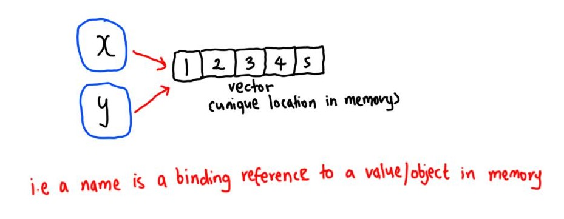

---
title: "Chapter 2: Names and Values"
author: "Erika Duan"
date: "`r Sys.Date()`"
output: github_document
---  

```{r, message = FALSE, warning = FALSE}
#-----load R libraries-----   
if (!require(pacman)) install.packages("pacman")
p_load(lobstr,
       tidyverse)  
```


# Aim  

Understanding the distinction between an **object** and its **name** helps you to:    

+ Better predict the performance and memory usage of your code.   
+ Write faster code by avoiding accidental copies, a major source of slow code.     
+ Better understand R’s functional programming tools.   

**In R, it is the name that has a value bound to it.**    

```{r, echo = FALSE, fig.align = 'center', fig.show = 'hold', out.width = '70%'}  
  
```

```{r}
#-----exercise 1.1-----
a <- 1:10 
b <- a 
c <- b
d <- 1:10

object_funs <- function(object) {
  object
} 

e <- object_funs(object = a)

# (a) is a name that is assigned to a specific object [object 1:10]
# (a) and (b) are both names that point to the same object in memory
# (c) is a name that points to the name (b) - therefore (c) should point to what (a) and (b) are point to
# (d) is a value that is pointing to a new object [object 1:10]

obj_addr(a)
obj_addr(b)
obj_addr(c)
obj_addr(d)
obj_addr(e)
```

```{r}
#-----exercise 1.2-----  
# do the following functions all point to the same nameless object? 
# maybe a new object is generated each time the function runs? 
# it turns out that they are all the same object!

obj_addr(mean) 
obj_addr(base::mean) # same thing as mean
obj_addr(get("mean"))
obj_addr(evalq(mean))
obj_addr(match.fun("mean"))   
```

```{r}
#-----exercise 1.3 - 1.5-----  
# read.csv(check.names = T) automatically converts non-syntactic names to syntactic ones  
# names are adjusted by make.names()  
```

```{r}
# Whenever you modify an object that has a name assigned to it, 
# you are not actually modifying the object itself,
# but creating a new object and re-binding your name to the new object. 
```

```{r}
x <- c(1, 2, 3)
obj_addr(x)
#> [1] "0x296794a4b38"

cat(tracemem(x))
#> <00000296794A4B38>

y <- x 
y[2] <- 1  
#> tracemem[0x00000296794a4b38 -> 0x00000296793ed828]: 
# tracing only happens when an object has more than one name bound to it now  

y <- c(y, 4, 5) 
obj_addr(y) 
#> "0x2967998aa18" # i.e. y now points to a completely different object  

untracemem(x) # turns tracing off  
```

```{r}
# lists are shallow copies  
```

