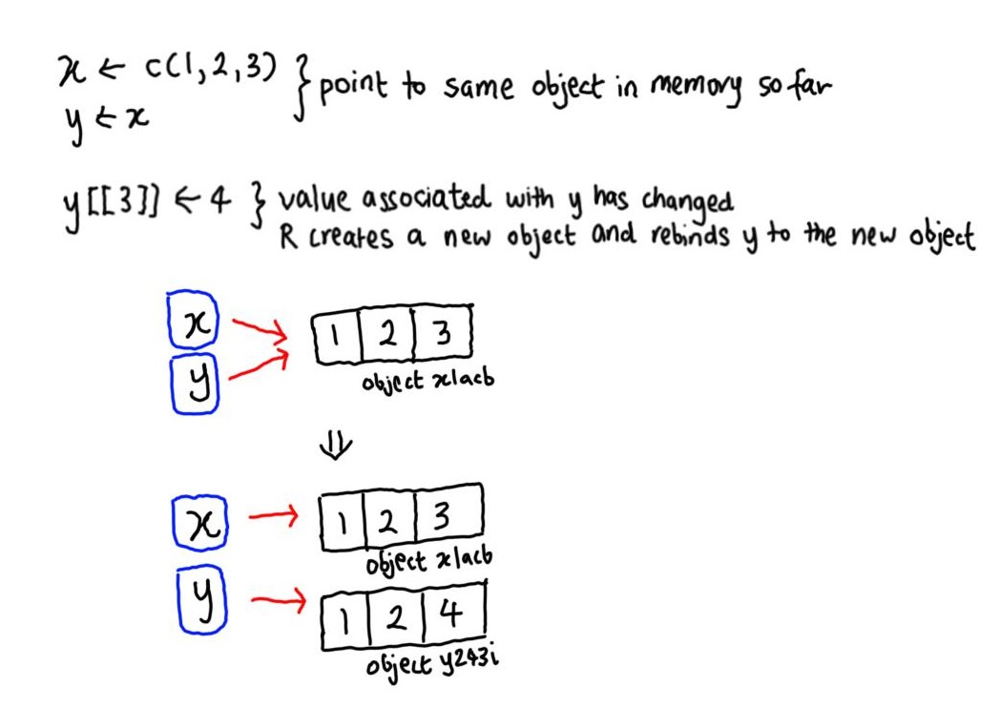
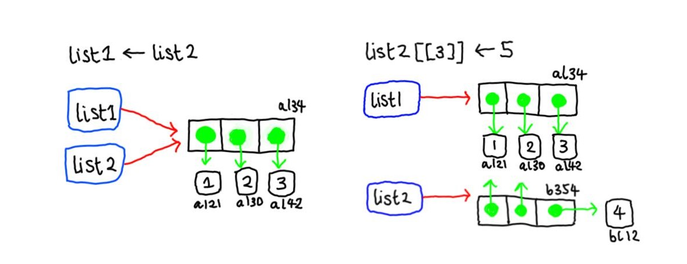
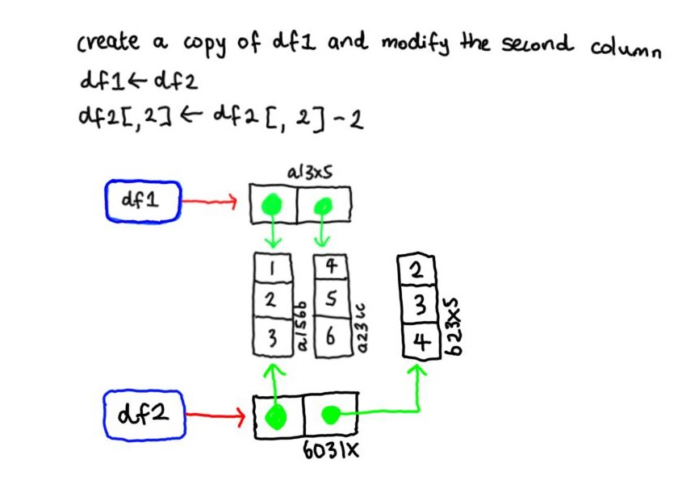
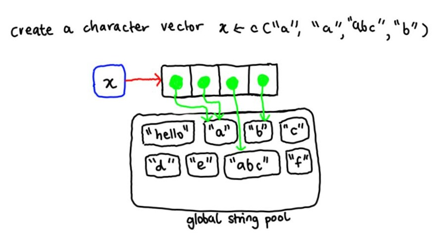
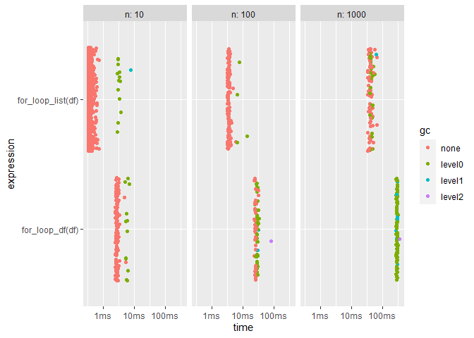
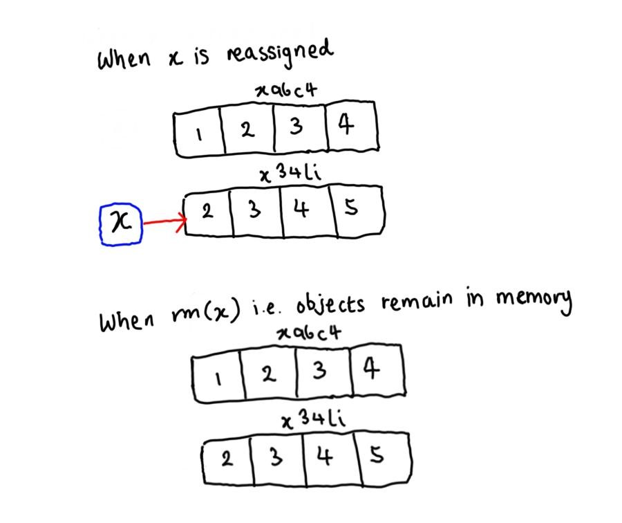

Chapter 2: Names and Values
================
Erika Duan
2020-12-21

  - [Chapter goals](#chapter-goals)
  - [Binding basics](#binding-basics)
  - [Copy-on-modify](#copy-on-modify)
      - [Lists](#lists)
      - [Data frames](#data-frames)
      - [Character vectors](#character-vectors)
  - [Object size](#object-size)
  - [Modify-in-place](#modify-in-place)
      - [Objects with a single binding](#objects-with-a-single-binding)
      - [Environments](#environments)
  - [Unbinding and the garbage
    collector](#unbinding-and-the-garbage-collector)

``` r
#-----load R libraries-----   
if (!require(pacman)) install.packages("pacman")
p_load(lobstr, # package to examine internal representation of R objects
       bench, # package to benchmark code execution times  
       tidyverse)  
```

# Chapter goals

Understanding the distinction between an **object** and its **name**
helps you to:

  - Better predict the performance and memory usage of your code.  
  - Write faster code by avoiding accidental copies, a major source of
    slow code.  
  - Better understand R’s functional programming tools.

# Binding basics

**In R, it is the object that is created and then has a name bound to
it.**

To check this, we can access an object’s unique identifier using the
function `lobstr::obj_addr()`.  
An object’s location in memory (i.e. memory address) changes every time
the code is run. This also means that the `obj_addr` output will change
every time we restart R.


``` r
#-----exercise 2.2.2.1-----
a <- 1:10 
b <- a 
c <- b
d <- 1:10  

# a is the name that is assigned to a specific object in memory i.e. object c(1:10)
# a and b are both names that point to the same object in memory
# c is a name that points to the name b - c should point to the object that a and b point to
# d is a name that points to a new object created in memory i.e. a second object c(1:10)   

obj_addr(a)
#> [1] "0x198432d8f78"

obj_addr(b)
#> [1] "0x198432d8f78"

obj_addr(c)
#> [1] "0x198432d8f78"

obj_addr(d)
#> [1] "0x1983d4afcb8"  

#-----what if the object assignment occurs via a function-----
object_funs <- function(object) {
  return(object)
} 

e <- object_funs(object = a)

# we are still creating a name and binding it to an existing object in memory
# e is a new name that points to the same object that a points to  

obj_addr(e)  
#> [1] "0x198432d8f78"  
```

The evaluation or expression of a nameless function always points to the
same object in memory. However, once the output of a function has a name
bound to it, each named output now exists as a separate object in
memory.

``` r
#-----exercise 2.2.2.2-----  
# do the following functions all point to the same nameless object? 
# maybe a separate new object is generated each time the function runs? 
# it turns out that they are all expressions of the same function -> evaluated object  

obj_addr(mean) 
#> [1] "0x1983dd792b0"

obj_addr(base::mean) # same thing as mean 
#> [1] "0x1983dd792b0"

obj_addr(get("mean")) # get() returns the value of a named object  
#> [1] "0x1983dd792b0"  

obj_addr(evalq(mean))  
#> [1] "0x1983dd792b0"

obj_addr(match.fun("mean")) 
#> [1] "0x1983dd792b0"

#-----what happens if a function is rerun or takes different arguments----- 
# new or different objects should be created i.e. different unique object identifiers  

obj_addr(mean(c(1, 2, 3)))
#> [1] "0x25325bf1590"

obj_addr(mean(c(1, 2, 3)))
#> [1] "0x25325713d38"

obj_addr(mean(c(2, 3, 4)))
#> [1] "0x25324fb3858"

#-----what happens if we bind mean(x) to a value-----
a <- mean(c(1, 3))
b <- mean(c(1, 3))  
c <- a  

# (a) and (c) will point to the same object in memory
# (b) will point to a different object in memory 

obj_addr(a)
#> [1] "0x19842f4ca30"  

obj_addr(b) 
#> [1] "0x19842eb3130"  

obj_addr(c) 
#> [1] "0x19842f4ca30"  
```

R has strict rules about the properties of a valid name:

  - A name cannot begin with a digit or `_`.  
  - A name can contain letters, digits, `.` or `_`, but the use of `.`
    is not advised to minimise confusion.  
  - Reserved words like `if`, `else`, `TRUE` etc. cannot be used as
    object names.

<!-- end list -->

``` r
#-----exercise 2.2.2.3-----   
# read.csv() contains the default argument check.names = T
# this automatically converts non-syntactic names to syntactic ones via make.names()   

#-----exercise 2.2.2.4-----   
# make.names() rules 
# X is added as a prefix if the original name begins with "." or "_" or a digit  
# all invalid characters are translated to "."  
# "." is added after reserved words i.e. TRUE or if 
# duplicated values are altered by make.unique  
# missing values are translated to NA

#-----exercise 2.2.2.5-----   
# .123e1 is also not a syntactic name because it contains a "." followed by a number  

make.names('.123e1')
#> [1] "X.123e1"

make.names('TRUE')
#> [1] "TRUE."
```

# Copy-on-modify

**Copy-on-modify** refers to the fact that when a copy of an object is
modified, R creates a separate new object and the original name is bound
to the new object instead. This means that we can inadvertently clutter
our environment with multiple objects if we are not careful with
tracking named object modifications, especially inside functions.



``` r
#-----test tracemem()----- 
# applying tracemem traces when object by its memory address
# tracemem will print a message whenever that original object is copied, modified and assigned a new memory address

x <- c(1L, 2L, 3L)

tracemem(x)
#> [1] "<0000020269FDA4C0>"

y <- x
y[3] <- 4L 
#> tracemem[0x0000020269fda4c0 -> 0x0000020267708360]:      

# y and x are originally bound to the same object
# the object that y was bound to was then modified 
# R stores the modified object as a new object in memory bound only to y   

y[3] <- 6L
#> tracemem[0x0000020267708360 -> 0x0000020267f3a860]:     

# new object y only has a single name bound to it and undergoes modify-in-place optimisation instead 

untracemem(x)
```

## Lists

A list superficially appears to stores a collection (i.e. list) of
values/objects of differing lengths. It actually stores a collection of
references (i.e. names) pointing to objects stored in memory.

Note that a copy of a list is a shallow copy (i.e. the list and its
reference bindings are copied, but the objects that the references are
bound to are not copied).



The function `lobstr::ref()` is useful for identifying objects that are
shared across lists (i.e. different lists contain references pointing to
the same object).

``` r
#-----copy-on-modify behaviour of lists-----  
list_1 <- list(1, 2, 3)
list_2 <- list_1

ref(list_1, list_2)  
#> o [1:0x20269f86a30] <list> - local ID
#> +-[2:0x20267266668] <dbl> - memory address of first object
#> +-[3:0x20267266630] <dbl> - memory address of second object
#> \-[4:0x202672665f8] <dbl> - memory address of third object  

# modifying a single value in list 2 results in a shallow copy

list_2[[3]] <- 10

ref(list_1, list_2)

#> o [1:0x20269f86a30] <list> 
#> +-[2:0x20267266668] <dbl> 
#> +-[3:0x20267266630] <dbl> 
#> \-[4:0x202672665f8] <dbl> 
  
#> o [5:0x20269cc9740] <list> 
#> +-[2:0x20267266668] 
#> +-[3:0x20267266630] 
#> \-[6:0x2026794dbc8] <dbl> - list_2[[3]] now points to a new object in memory 
```

## Data frames

Data frames can be considered as lists of vectors. When you modify a
single column, only that column will be modified (the column points to
different objects in memory) and the remaining columns will still point
to their original objects in memory.



``` r
#-----modify a data frame by column-----
df_1 <- data.frame(c(1, 2, 3),
                   c(4, 5, 6))
df_2 <- df_1

ref(df_1, df_2)  
#> o [1:0x20269eb2840] <df[,2]> 
#> +-c.1..2..3. = [2:0x2026c4ee388] <dbl> 
#> \-c.4..5..6. = [3:0x2026c4ee298] <dbl>  

df_2[, 2] <- df_2[, 2] - 2
 
ref(df_1, df_2)   
#> o [1:0x20269eb2840] <df[,2]>    
#> +-c.1..2..3. = [2:0x2026c4ee388] <dbl>    
#> \-c.4..5..6. = [3:0x2026c4ee298] <dbl>    
  
#> o [4:0x20268636840] <df[,2]>   
#> +-c.1..2..3. = [2:0x2026c4ee388]    
#> \-c.4..5..6. = [5:0x2026752a860] <dbl> - only one new column is created   

#-----modify a data frame by row modifies every column-----
df_3 <- df_1
df_3[1, ] <- df_3[1, ] * 1

ref(df_1, df_3)
#> o [1:0x20269eb2840] <df[,2]>    
#> +-c.1..2..3. = [2:0x2026c4ee388] <dbl>   
#> \-c.4..5..6. = [3:0x2026c4ee298] <dbl>   
  
#> o [4:0x20269dbdf48] <df[,2]>   
#> +-c.1..2..3. = [5:0x2026c9507d8] <dbl> - all columns recreated    
#> \-c.4..5..6. = [6:0x2026c950788] <dbl> - as at least one value per column is modifed  
```

## Character vectors

Character vectors are stored in a different manner to numerical vectors.
For character vectors, R uses a **global string pool** (a pool
containing all unique strings) where each element of the character
vector points to a unique string.



``` r
#-----examine character vector references------
x <- c("an", "ant", "ate", "an", "ant", "aye?")

ref(x, character = T) 
#> o [1:0x2026d27f020] <chr> 
#> +-[2:0x202606756f8] <string: "an"> 
#> +-[3:0x20268c9d0e0] <string: "ant"> 
#> +-[4:0x20268fe93d0] <string: "ate"> 
#> +-[2:0x202606756f8] - points to the same unique string "an"
#> +-[3:0x20268c9d0e0] - points to the same unique string "ant"  
#> \-[5:0x20268fe92b8] <string: "aye?"> 
```

``` r
#-----exercise 2.3.6.1-----   
# tracemem(1:10) is not useful as the values 1:10 have not been assigned a name 
# tracemem() is useful for tracing when named objects are subsequently copied and modified

#-----exercise 2.3.6.2-----  
x <- c(1L, 2L, 3L)

tracemem(x)

x[[3]] <- 4 # creates a new copy of x as double type, then modified x[[3]] with double == 4
#> tracemem[0x000002026871ca60 -> 0x0000020268955060]: 
#> tracemem[0x0000020268955060 -> 0x000002026cbf2788]: 

untracemem(x)

y <- c(1L, 2L, 3L)

tracemem(y)

y[[3]] <- 4L # same integer type  
#> tracemem[0x0000020269ea9460 -> 0x0000020269eacaa0]:   

untracemem(y) 

#-----exercise 2.3.6.3-----   
a <- 1:10
b <- list(a, a)
c <- list(b, a, 1:10)

# a is a value that points to an object in memory c(1:10)
# b is a separate list that points back twice to a
# c is a separate list that points back to list b (a, a) and object a, and a new object in memory

ref(a, b, c)
#> [1:0x20267d504f8] <int> - a is bound to an object in memory 
  
#> o [2:0x20269f9f160] <list> - local ID for list b
#> +-[1:0x20267d504f8] - points back to object bound to a  
#> \-[1:0x20267d504f8] - points back to object bound to a  
  
# o [3:0x2026d31e2d0] <list> - local ID for list c 
# +-[2:0x20269f9f160] - points back to list b 
# +-[1:0x20267d504f8] - points back to object bound to a  
# \-[4:0x20267decb48] <int> - points to a new object in memory (series of integers) 

#-----exercise 2.3.6.4-----    
z <- list(1:10)

ref(z)
#> o [1:0x202673fb928] <list> 
#> \-[2:0x20266446110] <int> 

tracemem(z)

z[[2]] <- z # adds a new vector i.e. z <- c(1:10) in the original list 
#> tracemem[0x00000202673fb928 -> 0x00000202683fc6c8]: 

untracemem(z)

# z is modified so a new list reference is produced  
# the second value in list z points to the original object in memory  
 
ref(z)  
#> o [1:0x20269ea5160] <list> - new list reference 
#> +-[2:0x20266446110] <int> 
#> \-o [3:0x202673fb928] <list> 
#>   \-[2:0x20266446110]  
```

# Object size

The function `lobstr::obj_size` can be used to calculate the size of an
object. Note that `obj_size(x)` + `obj_size(y)` will only equal
`obj_size(x, y)` if there are no shared values.

``` r
#-----calculating how much memory an object takes-----
dim(iris)
#> [1] 150   5    

obj_size(iris)
#> 7,688 B 

#-----list sizes are smaller when referencing the same values-----
x <- runif(1e6) # 1 million random values

obj_size(x)
#> 8,000,048 B

list_x <- list(x, x, x)
obj_size(list_x)
#> 8,000,128 B # only 80 B larger than x

obj_size(list(NULL, NULL, NULL))
#> 80 B is the size of an empty list with three elements   

obj_size(list(NA, NA, NA))
#> 248 B

obj_size(list(1, 1, 1))
#> 248 B 

# obj_size(list(NA, NA, NA)) produces a slightly larger object 
# NA is treated as a logical type that denotes a missing value  
# https://www.r-bloggers.com/r-na-vs-null/  
```

``` r
#-----character vector size is small because references point to a global unique string pool-----
obj_size("banana")
#> 112 B

obj_size(c(rep("banana"), 10000))
#> 176 B
```

Note that R 3.5.0 and later versions operates using compact storage of
certain vector types i.e. for numbers `1:j`, only the first and last
numbers are stored. This is called **alternate representation**.

``` r
#-----compact storage of 1:j vectors in R >= 3.5.0-----
obj_size(1:5)
#> 680 B

obj_size(1:50000)
#> 680 B 

# obj_size(c(1:50000)) does not work because it creates a vector of 50000 individual values      

obj_size(c(1:50000))
#> 200,048 B
```

``` r
#-----exercise 2.4.1.1-----  
y <- rep(list(runif(n = 1000, min = 0, max = 1)), 100)

# y is a list of 100 identical values (each containing a numerical vector of n = 1000)

object.size(y)
#> 8005648 bytes
obj_size(y)
#> 80,896 B

# use lobstr::obj_size() because object.size() does not detect if elements of a list are shared

x <- rep("cat", 100) # x is a vector as opposed to a list  

object.size("cat")
#> 112 B  

object.size(x)
#> 904 bytes

obj_size(x)
#> 904 B 

# object.size() does detect if elements of a vector are shared  

#-----exercise 2.4.1.3-----  
a <- runif(n = 1e6)
obj_size(a)
#> 8,000,048 B 

b <- list(a, a)
obj_size(b) 
#> 8,000,112 B 

obj_size(a, list(NULL, NULL))
#> 8,000,112 B  

obj_size(a, b) # identical size to list b as it is still a list with two elements    
#> 8,000,112 B

b[[1]][[1]] <- 10
obj_size(b) 
#> 16,000,160 B 

# the size of object b is approximately doubled because b contains vector a and a newly modified vector of size a 

obj_size(a, b) 
#> 16,000,160 B

b[[2]][[1]] <- 10 # because b[[1]] and b[[2]] are still different to each other
obj_size(b)
#> 16,000,160 B

# modification of element b[[2]] means b[[1]] and b[[2]] still point to different objects in memory  

obj_size(a, b) 
#> 24,000,208 B  

# collective object memory size increases because neither elements in list b point to a  
```

# Modify-in-place

Although modifying an R object usually creates a copy (via
copy-on-modify), two exceptions exist.

## Objects with a single binding

If an object only has a single name bound to it, R will modify it in
place via a special performance optimisation.

``` r
#-----trace object address for objects with a single binding-----  
v <- c(1, 2, 3)

tracemem(v)  
#> [1] "<000002026FB6D550>" 

v[3] <- 10   
#> tracemem[0x000002026fb6d550 -> 0x0000020268fb75d0]:   

# single object is modified in place and the new object address is different  
```

Note that predicting when modify-in-place occurs is harder than it
sounds. For instance:

  - When you evaluate the majority of functions, doing so creates a
    reference to the object.  
  - When you apply a for loop onto a data frame, each iteration creates
    multiple copies of the object from its current iteration. This
    behaviour is negated if you convert the data frame into a list.
    Modifying a list uses internal C code, so references are not
    incremented and only a single copy is made.

<!-- end list -->

``` r
#-----applying for loops on data frames creates multiple copies per iteration-----
# create data frame and calculate data frame column median values  

df <- data.frame(matrix(seq(1, 30, 1), ncol = 3, byrow = F))  
df_medians <- vapply(df, median, FUN.VALUE = numeric(1))   

# create a for loop which subtracts the median value of each column from the data frame  

tracemem(df)
#> [1] "<000001B5A8EFDDF0>"

for (i in seq_along(df_medians)) {
  df[i] <- df[i] - df_medians[[1]]
}
#> tracemem[0x000001b5a8efddf0 -> 0x000001b5a9b66e10]: - copy 1 of iteration 1  
#> tracemem[0x000001b5a9b66e10 -> 0x000001b5a9b66cd0]: [<-.data.frame [<- - copy 2 of iteration 1
#> tracemem[0x000001b5a9b66cd0 -> 0x000001b5a9b66c30]: [<-.data.frame [<- - copy 3 of iteration 1
#> tracemem[0x000001b5a9b66c30 -> 0x000001b5a9b663c0]: - copy 1 of iteration 2 i.e. final object copy from iteration 1 is newly copied
#> tracemem[0x000001b5a9b663c0 -> 0x000001b5a9b662d0]: [<-.data.frame [<- 
#> tracemem[0x000001b5a9b662d0 -> 0x000001b5a9b66280]: [<-.data.frame [<- 
#> tracemem[0x000001b5a9b66280 -> 0x000001b5a9b65a60]: 
#> tracemem[0x000001b5a9b65a60 -> 0x000001b5a9b65970]: [<-.data.frame [<- 
#> tracemem[0x000001b5a9b65970 -> 0x000001b5a9b658d0]: [<-.data.frame [<- 
#> tracemem[0x000001b5a9b658d0 -> 0x000001b5a9b6be18]: as.list.data.frame as.list vapply which .rs.frameCols .rs.toDataFrame <Anonymous> 

untracemem(df)
```

``` r
#-----applying for loops on lists avoids creating incremental object copies-----  
list_df <- as.list(df)
list_medians <- vapply(df, median, FUN.VALUE = numeric(1))    

tracemem(list_df)  
#> [1] "<000001B5A9B12978>"  

for (i in seq_along(list_medians)) {
  list_df[[i]] <- list_df[[i]] - list_medians[[1]] 
}
#> tracemem[0x000001b5a9b12978 -> 0x000001b5a8e186e0]:   

untracemem(df) 
```

**Note:** The output of `as.list(df)` versus `list(df)` are very
different. The former still allows you to subset data frame columns
using the `list_df[[i]]` syntax, whereas the latter always outputs the
entire data frame.

## Environments

Environments are a special objecttype and they are always modified in
place. When you modify an environment, all existing bindings to that
environment continue to have the same reference. This idea can be used
to create advanced functions that “remember” their previous state
(i.e. the R6 object oriented-programming system).

``` r
#-----modify an environment-----
e1 <- rlang::env(a = 1, b = 2, c = 3)
e2 <- e1

ref(e1, e2)  
#> o [1:0x2026dc7a2c8] <env> 
#> +-a = [2:0x202676bfcf8] <dbl> 
#> +-b = [3:0x202676bfd30] <dbl> 
#> \-c = [4:0x202676bfd68] <dbl> 
 
#> [1:0x2026dc7a2c8] 

e1$c <- 10 

# modifying e1$c modifies the object that c is now pointing to 

e2$c
#> [1] 10

# therefore e2$c also changes (it is now pointing to the same new object)
```

``` r
#-----exercise 2.5.3.1-----  
# why is a circular loop (i.e. where empty lists keep getting added to x) not created?
x <- list()

obj_addr(x)
#> [1] "0x25a8bcfd368"

tracemem(x)

x[[1]] <- x 
#> tracemem[0x0000025a8bcfd368 -> 0x0000025a91283258]: 

untracemem(x)  

# a copy of the original object x was created, modified in place and x is newly assigned to a reference
# however it is the original object x that remains as an object in memory    

ref(x)
#> o [1:0x25a917c73c0] <list> # copied object has new memory address
#> \-o [2:0x25a8bcfd368] <list> # list element somehow points to the original unmodified object    

#-----exercise 2.5.3.2-----
# wrap for loops inside functions  
for_loop_df <- function(df){
  df_medians <- vapply(df, median, FUN.VALUE = numeric(1))   
  
  for (i in seq_along(df_medians)) {
    df[i] <- df[i] - df_medians[[1]]
  }
}

for_loop_list <- function(df){
  list_df <- as.list(df) 
  list_medians <- vapply(list_df, median, FUN.VALUE = numeric(1)) 
  
  for (i in seq_along(list_medians)) {
    list_df[[i]] <- list_df[[i]] - list_medians[[1]]
  }
}

# perform benchmark with parameter tuning   

benchmark_results <- bench::press(
  n = c(10, 100, 1000),
  {
    df <- data.frame(matrix(runif(n * 100), ncol = n, byrow = F)) 
    
    bench::mark(min_iterations = 100,
                for_loop_df(df),
                for_loop_list(df))
  }
)
```

    ## Warning: Some expressions had a GC in every iteration; so filtering is
    ## disabled.

``` r
autoplot(benchmark_results, type = "jitter")  
```

<!-- -->

``` r
#-----exercise 2.5.3.3-----  
# an error message is produced for tracemem(e1)    
# tracemem() is not useful for environment objects as environments are always modified in place     
```

# Unbinding and the garbage collector

Removing a value does not clear up your memory, as the only the value
that points to an object in memory is removed (i.e. the objects
themselves are valueless but still stored in memory). In R, the job of
deleting valueless objects in memory belongs to the **garbage
collector**.

The garbage collector frees up memory by deleting R objects that are no
longer used (i.e. nameless objects) and requests more memory from the
operating system as needed.



Note that the garbage collector runs automatically whenever R needs more
memory to create a new object, and that there is no need to manually
call `gc()` yourself.

The only reasons to call gc() are:

  - To ask R to return memory to your operating system so other programs
    can use it.  
  - To print how much memory is currently being used by R.

<!-- end list -->

``` r
#-----run garbage collector-----  
gc() 
#>            used  (Mb) gc trigger  (Mb) max used  (Mb)
#> Ncells  2579543 137.8    4398084 234.9  4398084 234.9
#> Vcells 10171012  77.6   17824054 136.0 15963036 121.8

mem_used() # a wrapper that prints the total number of bytes used  
#> 225,822,848 B
```
