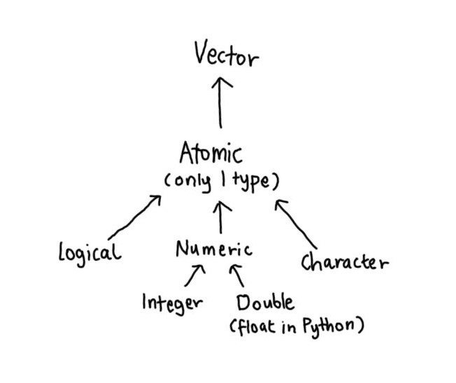
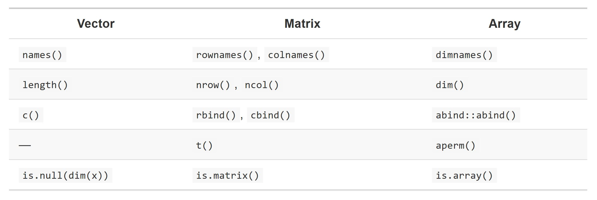
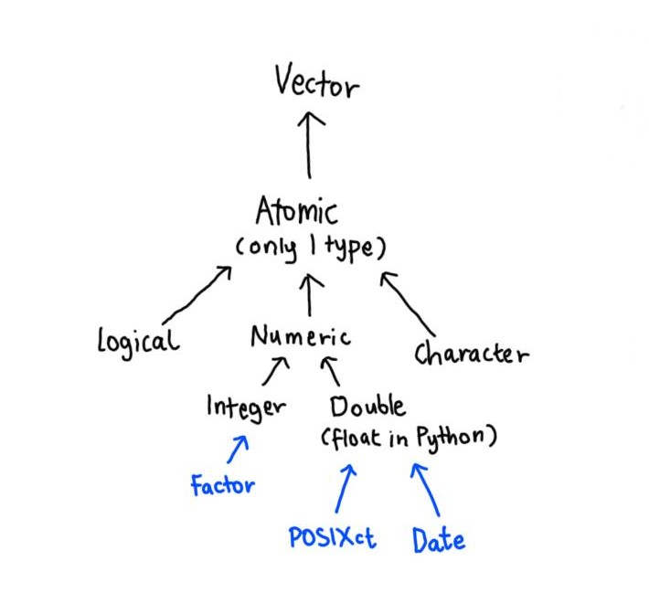
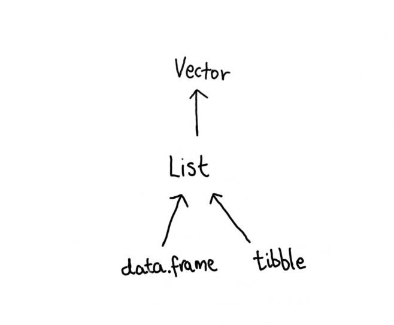

---
title: "Chapter 3: Vectors"
author: "Erika Duan"
date: "`r Sys.Date()`"
output: 
  github_document:
    toc: true
---  

```{r setup, include = FALSE}
knitr::opts_chunk$set(echo = TRUE, results = 'hide')
```

```{r, message = FALSE, warning = FALSE}
#-----load R libraries-----   
if (!require(pacman)) install.packages("pacman")
p_load(tidyverse)  
```


# Chapter goals     

Understanding the properties and behaviours of vectors helps you to:    

+ Understand the difference between atomic vectors and lists.  
+ Understand how different object types (i.e. factors, dates, matrixes, data frames) are created from atomic vectors.     


# Vector types    

There are techincally three different types of vectors:   

+ Atomic vector - elements in an atomic vector must all be of the same type.       
+ List - elements in a list can be of different types.     
+ `NULL` - can be viewed as a separate generic type of zero length.    

Vectors have attributes (i.e. a list of metadata). The **dimension** attribute turns vectors into matrices and arrays and the **class** attribute powers the S3 object system (i.e. factors, date and times, data frames, and tibbles).   


## Atomic vectors    

There are four types of atomic vectors:  

+ **Logicals**   
  + Vectors only consists of `TRUE` or `FALSE` (or `NA` to denote missingness).      
+ **Integers**    
  + Integers are whole numbers and can be explicitly assigned using `L`.    
  + Can be specified in scientific (1e4L) or hexadecimal (0xcafeL) form.   
+ **Doubles**   
  + Can be specified in decimal (0.1234), scientific (1.23e4), or hexadecimal (0xcafe) form.
  + The special characters `Inf`, `-Inf`, and `NaN` (not a number) are also doubles.   
+ **Strings**   
  + Characters are denoted as strings.      
  + Strings are surrounded by `"str"` (or `'str'`) quotation marks. Note that individual characters inside strings can be escaped using `\` i.e. `\n` creates a new line instead of printing `\n`.       
  
**Note:** The type of an atomic vector can be determined using the function `typeof()`.  
  
```{r, echo = FALSE, results = 'markup', fig.align = 'center', fig.show = 'hold', out.width = '60%'}  
  
```

```{r}
#-----what atomic vector types look like----- 
a <- c(TRUE, TRUE, FALSE, NA)

typeof(a)
#> [1] "logical"

as.numeric(a)
#> [1]  1  1  0 NA

# TRUE is converted to 1 and FALSE is converted to 0  

as.integer(a)
#> [1]  1  1  0 NA

as.character(a)
#> [1] "TRUE"  "TRUE"  "FALSE" NA     
```
  

## Missing values  

Missing values are considered infectious i.e. computations involving missing values return missing values. This is why `is.na(x)`, which we want to return `TRUE` or `FALSE`, is required to subset values that are `NA` instead of using `x == NA`.        

```{r} 
#-----computations with NA-----
NA * 10
#> [1] NA

5 > NA
#> [1] NA  

!NA
#> [1] NA  

x <- c(1, NA, 2, NA)    
x == NA    
#> [1] NA NA NA NA    

# the infectiousness of NA explains why x == NA does not subset the correct values       
# it also explains where na.rm = TRUE exists as a separate argument inside functions     

#-----notable weird exceptions-----
NA | TRUE
#> [1] TRUE  

NA | FALSE 
#> [1] NA

NA & TRUE
#> [1] NA  

NA & FALSE
#> [1] FALSE  
```

**Note:** `NA` is automatically coerced to the correct type as needed i.e. from `NA` to `NA_integer_` if the atomic vector contains only integers.     


## Testing and coercion  
 
Atomic vectors contain elements of the same type. When you combine different types using `c()`, elements are coerced in a fixed order: character → double → integer → logical.   

```{r}
#-----test vector type-----  
is.integer(1)
#> [1] FALSE

is.integer(1L)
#> [1] TRUE  

#-----assess coercion order-----
typeof(c("a", 1))
#> [1] "character"   

typeof(c(TRUE, 1L))
#> [1] "integer"   

typeof(c(TRUE, 1))
#> [1] "double"     

typeof(c(1.0, 1L))  
#> [1] "double"  
```

Most mathematical functions will automatically coerce the input vector to numeric type and this is the reason why functions like `sum()` and `summary()` can count the number of logical elements. 

```{r}
#-----automatic conversion of mathematical functions to numeric type-----
sum(c(T, T, F, T, F, NA), na.rm = T)
#> [1] 3

summary(c(T, T, F, T, F, NA), na.rm = T)
#>    Mode   FALSE    TRUE    NA's 
#> logical       2       3       1 
```

**Note:** Failed conversions trigger the error message `Warning: NAs introduced by coercion`.    

```{r}
#-----exercise 3.2.5.1----- 
# complex numbers can be created using the function complex()    
# conversions to complex numbers are done using as.complex()    

# raw vectors hold raw bytes and is not normally used for data analysis      
# raw vectors can be created using the function raw()    
# conversions to raw vectors are done using as.raw()   

#-----exercise 3.2.5.2-----
typeof(c(1, FALSE))
#> [1] "double"

typeof(c("a", 1))
#> [1] "character" 

typeof(c(TRUE, 1L))
#> [1] "integer"   

#-----exercise 3.2.5.3-----
# 1 == "1" is TRUE    
# the operator function also automatically converts vectors to the same type      
# 1 is converted into "1" and "1" = "1" is true    

typeof(c(1, "1"))
#> [1] "character"

# -1 < FALSE is TRUE    
# FALSE is converted into 0 and -1 < 0 is true  

typeof(c(-1, FALSE))
#> [1] "double"

# "one" < 2 is false  
# 2 is converted into "2" and "2" takes precendent before "o" in R    

typeof(c("one", 2))
#> [1] "character"  

#-----exercise 3.2.5.4-----
# NA is logical type by default because it is the highest element level and most flexible to coercions  
# i.e. c(FALSE, NA_character_) coerces the rest of the objects into a character as well  

typeof(c(TRUE, NA_character_))
#> [1] "character" 

typeof(c(TRUE, NA))
#> [1] "logical"  

#-----exercise 3.2.5.5-----  
# is.vector returns TRUE if x is a vector which only has a name attribute

is.vector(matrix(1:9, nrow = 3))
#> [1] FALSE 
# matrices also have a dimension attribute  

is.vector(c(1:9))
#> [1] TRUE

# is.numeric returns TRUE if x is numeric i.e. double or integer type and not a factor 
# note that double is the name of the type and numeric is the name of the mode and implicit class  
```


# Vector attributes  

Attributes are name-value pairs that attach metadata to an object. Individual attributes can be retrieved and modified with `attr()`, or retrieved en masse with `attributes()`, and set en masse with `structure()`.   

Individual attributes are emphemeral in that they are lost when passed through a function. The exceptions are the attributes **dim** (dimensions) and **name**. To preserve other attributes, an individual S3 class needs to be separately created.    

**Note:** You can use the function `str(attributes(object))` to print a tidied summary of object attributes.    

```{r}
#----create a single vector attribute----- 
a <- LETTERS[1:5]

attr(a, "case") <- "upper" # assign attribute value to object and attribute key  

attributes(a)
#> $case
#> [1] "upper"

#-----create a set of vector attributes-----
b <- structure(letters[1:5], # object to create attributes for  
               language = "English",
               case = "lower",
               length = 26L)

attributes(b)  
#> $language
#> [1] "English"
#> 
#> $case
#> [1] "lower"
#> 
#> $length
#> [1] 26

#-----attributes are lost once we pass the vector through another function-----
str_c(b, collapse = "")
#> [1] "abcde"  

attributes(str_c(b, collapse = ""))
#> NULL  
```


## Names  

Names are an important character vector attribute and should be unique and non-missing. 

Names can be set in three ways:    

1. As it is being created i.e. `x <- c(name1 = value1, name2 = value2, name3 = value3)`.        
2. Passing a character vector through `names()`.    
3. Passing the value and character vector inline through `setNames`.     

```{r}
#-----set names method 1-----
d <- c(a = 1, b = 2, c = 3) # name = value  

d
#> a b c 
#> 1 2 3 

e <- c(lower = letters) # names are coerced to be unique     

e[c(1:3)]
#> lower1 lower2 lower3 
#>    "a"    "b"    "c"  

# code behaves differently in that non-unique names are converted into a unique form i.e. lower1 to lower26   
# automatic conversion of non-unique names does not otherwise happen for vectors 

#-----set names method 2-----  
f <- c(1:3)
names(f) <- c("a", "b", "c")

f
#> a b c 
#> 1 2 3

#-----set names method 3-----  
g <- setNames(1:3, c("a", "b", "c")) # input value and character vector of names in the same line  

g
#> a b c 
#> 1 2 3

#----remove names-----
names(g) <- NULL

g
#> [1] 1 2 3
```


## Dimensions  

Adding a dim attribute to a vector allows it to behave like a 2-dimensional matrix or a multi-dimensional array. Matrices and arrays can be created with `matrix()` and `array()` respectively, or by using the assignment form of `dim()`.  

```{r}
#-----create a matrix-----  
m <- matrix(1:6,
            nrow = 2, 
            byrow = FALSE)

m
#>      [,1] [,2] [,3]
#> [1,]    1    3    5
#> [2,]    2    4    6

#-----create two matrices within a single object using array()-----  
m_array <- array(1:12, 
                 dim = c(2, 3, 2)) # order of dimensions is by number of  rows, cols and matrices  

m_array
# , , 1 
 
#      [,1] [,2] [,3]
# [1,]    1    3    5
# [2,]    2    4    6
 
# , , 2
 
#      [,1] [,2] [,3]
# [1,]    7    9   11
# [2,]    8   10   12

#-----create a matrix by setting dim()-----
m <- c(1:6)  
dim(m) <- c(3, 2) # order of dimensions is by rows and cols 

m
#      [,1] [,2]
# [1,]    1    4
# [2,]    2    5
# [3,]    3    6
```

Equivalent dimension-related functions exist for vectors, matrices and arrays, with diagram from [Advanced R by Hadley Wickham](https://adv-r.hadley.nz/vectors-chap.html#attributes).   

```{r, echo = FALSE, results = 'markup', fig.align = 'center', out.width = '80%'}  
  
```

Because matrices and arrays are created by setting a dimension attribute, they may appear indistinguishable from vectors when passed through `cat()`. However, structural naunces (as set by their dimensions) remain and can be identified using `str()` or `print()`.    

```{r}
#-----distinguishing between a vector, matrix or array-----
# using cat() conserves less object structure than print()
cat(1:3)
#> 1 2 3

cat(matrix(1:3, nrow = 3))
#> 1 2 3

cat(array(1:3, dim = c(3, 1, 1))) 
#> 1 2 3

# using print() 

print(1:3)
#> 1 2 3

print(matrix(1:3, nrow = 3))
#>      [,1]
#> [1,]    1
#> [2,]    2
#> [3,]    3

print(array(1:3, dim = c(3, 1, 1))) # note that array(1:3, c(3, 1, 1)) == matrix(1:3, nrow = 3)
#>      [,1]
#> [1,]    1
#> [2,]    2
#> [3,]    3

# using str() prints a flattened summary of matrix or array dimensions 

str(1:3)                   
#>  int [1:3] 1 2 3

str(matrix(1:3, nrow = 3)) 
#>  int [1:3, 1] 1 2 3

str(matrix(1:3, nrow = 1)) 
#>  int [1, 1:3] 1 2 3

str(array(1:3, dim = c(3, 1, 1)))        
#>   int [1:3, 1, 1] 1 2 3     
```

```{r}
#-----exercise 3.3.4.2-----
setNames <- function(object, nm) {
  names(object) <- nm
  object
}

# the data object is the first argument and is magrittr-pipe operator friendly  

unname <- function(obj, force = FALSE) {
  if (!is.null(names(obj))) 
    names(obj) <- NULL
  if (!is.null(dimnames(obj)) && (force || !is.data.frame(obj))) 
    dimnames(obj) <- NULL
  obj
}

# unname sets the data object name to NULL
# accounts for vectors and matrices and data frames  

#-----exercise 3.3.4.2-----
v <- c(1:3)
dim(v) 
#> NULL 

# dim() returns NULL because 1-dimensional vectors are defined by their lack of a dimension  
# nrow() and ncol() are used to query the dimensions of a matrix or data.frame

#-----exercise 3.3.4.3-----
x1 <- 1:5 # 1-dimensional vector 
str(x1)
#> int [1:5] 1 2 3 4 5

x2 <- array(1:5, c(1, 1, 5)) # 5 1-dimensional arrays with 1 value each 
str(x2)
#> int [1, 1, 1:5] 1 2 3 4 5

x3 <- array(1:5, c(1, 5, 1)) # 1x5 2-dimensional array identical to matrix(1:5, ncol = 5)
str(x3)
#> int [1, 1:5, 1] 1 2 3 4 5

x4 <- array(1:5, c(5, 1, 1)) # 5x1 2-dimensional array identical to matrix(1:5, nrow = 5)
str(x4)
#> int [1:5, 1, 1] 1 2 3 4 5

#-----exercise 3.3.4.4-----
structure(1:5, comment = "my attribute") 
# there are specific attribute names like comment which are not automatically printed    

y <- structure(1:5, comment = "my attribute")
attributes(y)
#> $comment
#> [1] "my attribute"
```


# S3 atomic vectors  

Possessing the vector attribute `class` is what separates an S3 object from a basic atomic vector. S3 atomic vectors also behave differently when passed to a generic function.      

The four main types of S3 objects are:  

+ **Factors**.         
+ **Dates** (with day level resolution), which are recorded in **Date vectors**.        
+ **Date-times** (with second or sub-second resolution), which are stored in **POSIXct vectors**.       
+ **Durations**, which are stored in **difftime vectors**.        

```{r, echo = FALSE, results = 'markup', fig.align = 'center', fig.show = 'hold', out.width = '60%'}  
  
```


## Factors  

A factor is a vector that can only contain predefined character values.   
Factors are built on top of an integer vector with two additional attributes:   

+ A `factor` class, which makes it behave differently from regular integer vectors.
+ Levels, which defines the set of allowed values.     

```{r}
#-----explore factor attributes-----
f <- factor(c("cat", "mouse", "mouse", "cat", "goose"))

f
#> [1] cat   mouse mouse cat   goose
#> Levels: cat goose mouse

typeof(f)
#> [1] "integer"

class(f) # class attribute for S3 objects
#> [1] "factor"  

str(attributes(f))
#> List of 2
#>  $ levels: chr [1:3] "cat" "goose" "mouse"
#>  $ class : chr "factor"

#-----difference between character vector and factor-----
# when you tabulate a factor you will get counts of all categories, even unobserved ones

tally <- c("m", "m", "m")
tally_factor <- factor(tally, levels = c("m", "f"))

table(tally)
#> tally
#> m 
#> 3

table(tally_factor)
#> tally_factor
#> m f 
#> 3 0 

#-----create ordered factors (i.e. akin to ordinal variables)-----
tally <- c("silver", "silver", "bronze", "gold", "bronze", "silver")
tally_factor <- ordered(factor(tally, levels = c("bronze", "silver", "gold"))) # smallest levels listed first

tally_factor
#> [1] silver silver bronze gold   bronze silver
#> Levels: bronze < silver < gold - denotes the presence of ordered factors  

#-----functions evaluating strings do not work on factors-----  
nchar(tally)
#> [1] 6 6 6 4 6 6  

# nchar(tally_factor)
#> Error in nchar(tally_factor) : 'nchar()' requires a character vector  
```

**Note:** Because factors are built on top of an integer vector, generic functions may treat factors like integers rather than character strings. Thus, a conversion to a character vector should be made when you need string-like behaviour.   


## Dates  

Dates are built on top of a double vector, with the double vector representing the **number of days since 1970-01-01**.   
Dates have a class `Date` and no other attributes.      

```{r}
#-----explore Date attributes----- 
today <- Sys.Date()

today
#> [1] "2020-06-18" 

typeof(today)
#> [1] "double"  

class(today)
#> [1] "Date"  

str(attributes(today))
#> List of 1
#> $ class: chr "Date"

#-----remove class "Date" to obtain the underlying double vector-----  
two_days_later <- as.Date("1970-01-03")

unclass(two_days_later)
#> [1] 2

as.double(two_days_later)
#> [1] 2  
```


## Date-times  

POSIX is short for Portable Operating System Interface, which is a family of cross-platform standards - “ct” stands for calendar time (the `time_t` type in C), and “lt” for local time (the `struct tm` type in C).  

POSIXct vectors are also built on top of double vectors, where the value represents the **number of seconds since 1970-01-01**. POSIXct vectors may also have an optional time zone attribute, which needs to be manually specified. The `tzone` attribute controls only how the date-time is formatted i.e. it prints `"AEST"` after the date-time S3 atomic vector.       

```{r}
#-----explore POSIXct attributes-----  
now_ct <- as.POSIXct("2020-06-18 23:00", tz = "Australia/Sydney") # adds a tzone attribute  

now_ct
#> [1] "2020-06-18 23:00:00 AEST"  

typeof(now_ct)
#> [1] "double"

class(now_ct)
#> [1] "POSIXct" "POSIXt"  

str(attributes(now_ct))
#> List of 2
#> $ class: chr [1:2] "POSIXct" "POSIXt"
#> $ tzone: chr "Australia/Sydney" 

# note that the time is not printed at midnight  

midnight <- as.POSIXct("2020-06-18 24:00", tz = "Australia/Sydney")
midnight
#> [1] "2020-06-19 AEST"  
```


## Durations  

Durations, which represent the amount of time between pairs of dates or date-times, are stored as the `difftime` class.      
Difftimes are built on top of a double vector, and have a units attribute that determines how the integer should be interpreted.      

```{r}
#-----explore difftime attributes-----
diff_1 <- as.difftime(1, units = "days")

diff_1
#> Time difference of 1 days

typeof(diff_1)  
#> [1] "double"  

class(diff_1) 
#> [1] "difftime"  

str(attributes(diff_1))
#> List of 2
#>  $ class: chr "difftime"
#>  $ units: chr "days"
```

```{r}
#-----exercise 3.4.5.1-----  
# table returns a table of counts (i.e. integers) at each combination of factor levels (i.e. character set)  

table_results <- table(c("cat", "cat", "mouse"))

table_results
#> cat mouse 
#>   2     1 

typeof(table_results)
#> [1] "integer" 

names(table_results)
#> [1] "cat"   "mouse"

class(table_results)
#> [1] "table"   

str(attributes(table_results))
#> List of 3
#>  $ dim     : int 2
#>  $ dimnames:List of 1
#>   ..$ : chr [1:2] "cat" "mouse"
#>  $ class   : chr "table"

#-----exercise 3.4.5.2-----  
f1 <- factor(letters)
f1[1:5]
#> [1] a b c d e
#> Levels: a b c d e f g h i j k l m n o p q r s t u v w x y z

levels(f1) <- rev(levels(f1))  
f1[1:5]
#> [1] z y x w v
#> Levels: z y x w v u t s r q p o n m l k j i h g f e d c b a

# rev provides a reversed version of its argument
# changing the level changes the set of values i.e. from a-z to z-a

#-----exercise 3.4.5.3-----  
f2 <- rev(factor(letters))
f2[1:5]
#> [1] z y x w v
#> Levels: a b c d e f g h i j k l m n o p q r s t u v w x y z

# f2 merely reverses the appearence of the object itself
# the levels should remain in the same order i.e. a-z

f3 <- factor(letters, levels = rev(letters))
f4 <- factor(letters)

f3[1:5]
#> [1] a b c d e
#> Levels: z y x w v u t s r q p o n m l k j i h g f e d c b a

f4[1:5]
#> [1] a b c d e
#> Levels: a b c d e f g h i j k l m n o p q r s t u v w x y z

# I originally expected f3 and f4 to print identical objects
# f3 is the same object as f4, the set of characters in each level is the same, but the order is reversed (but not ordered)    
```


# Lists  

Unlike a data frame, a list can contain vectors of different lengths and types. Each element in a list is just a reference that can refer to an object of any type, recalling [the chapter on names and values](https://github.com/erikaduan/Advanced-R-notes/blob/master/02_exercises/02_names-and-values.md).       

```{r}
#-----create list-----
list_1 <- list(integers = 1:3, 
               single_char = "a", 
               logical = c(TRUE, FALSE, TRUE), 
               doubles = c(2.3, 5.9))

list_1  
#> $integers
#> [1] 1 2 3
 
#> $single_char
#> [1] "a"
 
#> $logical
#> [1]  TRUE FALSE  TRUE
 
#> $doubles
#> [1] 2.3 5.9

typeof(list_1)
#> [1] "list"  

class(list_1)
#> [1] "list"

str(list_1)
#> List of 4
#>  $ integers   : int [1:3] 1 2 3
#>  $ single_char: chr "a"
#>  $ logical    : logi [1:3] TRUE FALSE TRUE
#>  $ doubles    : num [1:2] 2.3 5.9
```

If given a combination of atomic vectors and lists, `c()` will coerce the vectors to lists before combining them. This also means that lists can be thought of as recursive vectors (i.e. a list can contain lists).   

```{r}
#-----create named recursive list-----
list_2 <- list(first = list(1, 2),
               second = c(3, "4"))

# I expected list_2 to contain 2 rather than 3 objects 

str(list_2)
#> List of 2
#>  $ first :List of 2
#>   ..$ : num 1
#>   ..$ : num 2
#>  $ second: chr [1:2] "3" "4"

typeof(list_2$second)
#> [1] "double"   

#-----create unnamed recursive list-----   
list_3 <- c(list(1, 2),
            c(3, "4")) 

# I expect the same object output as list_2  
# this was wrong - c() coerces every individual object into a separate list  

str(list_3)
#> List of 4
#>  $ : num 1
#>  $ : num 2
#>  $ : chr "3"
#>  $ : chr "4"
```

```{r}
#-----coerce vector into a list-----
v <- c(1L:5L)

v
#> [1] 1 2 3 4 5   

typeof(v)
#> [1] "integer"

is.list(v)
#> [1] FALSE  

v_list <- as.list(v) # coerce into a list  

is.list(v_list)
#> [1] TRUE  

# use unlist() to turn a list of elements of the same type back into a vector  

v2 <- unlist(v_list)
v2
#> [1] 1 2 3 4 5  

typeof(v2)
#> [1] "integer"  
```

List-matrices and list-arrays are esoteric object structures but they can be useful if you want to arrange objects in a grid-like structure. For example, if you are running models on a spatio-temporal grid, it might be more intuitive to store the models in a 3D array.     

```{r}
#-----create list-----  
# elements of different types are concatenated  
list_4 <- list(first = 1:3,
               second = "a",
               third = c(TRUE, 1.0)) # enclosing elements inside c() causes coersion 

str(list_4) 
#> List of 3
#>  $ first : int [1:3] 1 2 3
#>  $ second: chr "a"
#>  $ third : num [1:2] 1 1

list_4[[3]]
#> [1] 1 1  

# difference when elements of different types are not concatenated   

list_5 <- list(first = 1:3,
               second = "a",
               third = TRUE, 1.0)   

str(list_5)
#> List of 4
#>  $ first : int [1:3] 1 2 3
#>  $ second: chr "a"
#>  $ third : logi TRUE
#>  $       : num 1   

list_5[[3]]
#> [1] TRUE   

#-----add dimensions to create a list-matrix-----  
dim(list_5) <- c(2, 2)

list_5 
#>      [,1]      [,2]
#> [1,] Integer,3 TRUE
#> [2,] "a"       1

# all 4 vectors in list_4 are now arranged in a 2D grid  

list_5[[2, 1]] # subset row 2 and column 1 for 2D grid  
#> [1] "a"  
```

```{r}
#-----exercise 3.5.4.1-----  
# a list is just a collection of references that refers to any object of any type in memory 
# using c() on a vector containing a list first coerces other atomic vectors into individual lists 
# a list can contain elements of different lengths and type  

#-----exercise 3.5.4.2-----  
v <- c(1L:3L)

v_list <- as.list(vector) # coerce into a list  

v_list  
#> [[1]]
#> [1] 1
 
#> [[2]]
#> [1] 2
 
#> [[3]]
#> [1] 3

v2 <- unlist(v_list) # creates atomic double vector  
v2
#> [1] 1 2 3 

#-----exercise 3.5.4.3-----  
new_date <- as.Date("2020-06-18")
new_date_time <- as.POSIXct("2020-06-18 23:00", tz = "Australia/Sydney")   

new_date
#> [1] "2020-06-18"
new_date_time
#> [1] "2020-06-18 23:00:00 AEST"

c_test <- c(new_date, new_date_time) # different vector types - should not work?  
c_test
#> [1] "2020-06-18"    "4362046-05-22"

class(c_test)
#> [1] "Date" # both coerced to Date vector type   

list_test <- list(new_date, new_date_time)
list_test
#> [[1]]
#> [1] "2020-06-18"

#> [[2]]
#> [1] "2020-06-18 23:00:00 AEST"

unlist(list_test)
#> [1]      18431 1592485200 

# coerced to their double vector value in days and seconds since 1970-01-01  
# coercion via unlist() is more meaningful than using c() on two different element types    
```


# Data frames and tibbles  

A data frame is a named list of vectors with attributes for **column names** (i.e. names), **row names** and `data.frame` as its class.    

The length of vectors within a data frame must also be the same. This provides data frames with their rectangular structure and explains why they share the properties of both matrices and lists.    

```{r, echo = FALSE, results = 'markup', fig.align = 'center', out.width = '50%'}  
  
```

## Differences between data frames and tibbles  

```{r}
#-----create and examine data frame attributes-----
df_1 <- data.frame("fruit" = c("apples", "lychee", "pears"),
                   "price" = c(1.5, 21, 0.99))      

typeof(df_1)
#> [1] "list"

class(df_1) 
#> [1] "data.frame"  

str(attributes(df_1))
#> List of 3
#>  $ names    : chr [1:2] "c.1..2..3." "c.4..5..6."
#>  $ class    : chr "data.frame"
#>  $ row.names: int [1:3] 1 2 3

str(df_1)
#> 'data.frame':	3 obs. of  2 variables:
#>  $ fruit: Factor w/ 3 levels "apples","lychee",..: 1 2 3
#>  $ price: num  1.5 21 0.99

#-----use stringsAsFactors = F-----
# data.frame causes automatic conversion of characters into factors
# remember to use stringsAsFactors = F to suppress this undesirable behaviour    

df_2 <- data.frame("fruit" = c("apples", "lychee", "pears"),
                   "price" = c(1.5, 21, 0.99),
                   stringsAsFactors = F)

str(df_2)
#> 'data.frame':	3 obs. of  2 variables:
#>  $ fruit: chr  "apples" "lychee" "pears"
#>  $ price: num  1.5 21 0.99
```

By contrast, tibbles never coerce their input (this is one feature that makes them lazy). Tibbles also do not transform non-syntactic names (i.e. does not automatically convert `1` into `X1` as a column name).     

```{r}
#-----create and examine tibble attributes-----
library(tibble)

tibble_1 <- tibble("fruit" = c("apples", "lychee", "pears"),
                   "price" = c(1.5, 21, 0.99))

typeof(tibble_1)
#> [1] "list"

class(tibble_1) 
#> [1] "tbl_df"     "tbl"        "data.frame"

str(attributes(tibble_1))
#> List of 3
#>  $ names    : chr [1:2] "fruit" "price"
#>  $ row.names: int [1:3] 1 2 3
#>  $ class    : chr [1:3] "tbl_df" "tbl" "data.frame" 

str(tibble_1)
#> Classes ‘tbl_df’, ‘tbl’ and 'data.frame':	3 obs. of  2 variables:
#>  $ fruit: chr  "apples" "lychee" "pears"
#>  $ price: num  1.5 21 0.99
```

Unlike data frames, tibbles only recycle vectors of shorter input length if the vector length is one.    

```{r, results = 'markup'}
#-----be careful of vector length recycling in data.frame-----  
df_2 <- data.frame("col_1" = c(1:6),
                   "col_2" = c(1:2)) # we expect NA to be populated for missing values  

knitr::kable(df_2) 

# col_2 is recycled until its length == length(col_1) 
# we actually want this type of behaviour to generate an error message    

#-----this behaviour is suppressed in tibbles-----
# tibble_2 <- tibble("col_1" = c(1:6),
#                    "col_2" = c(1:2)) 

# Error: tibble columns must have consistent lengths, only values of length one are recycled:
# * Length 2: Column `col_2` * Length 6: Column `col_1`
```


## Row names    

You can retrieve and set unique row names with rownames(), and you can use them to subset rows. This is because data frames share some behaviour with matrices (which only contain numerical values and are transposable).  

However, row names in data frames should be considered as an undesirable behaviour because:   

+ Storing one field in a different way to the rest of the data fields is fundamentally a bad idea (i.e. you need two separate approaches to analyse the same dataset).   
+ Row names only work when a row can be identified by a single character string (no numeric labels or labels with more than one vector i.e. latitude and longitude).  
+ Row names force unique row names to be used.  

For these reasons, tibbles do not support row names. Instead the tibble package provides tools to easily convert row names into a regular column with the rownames argument in `as_tibble()`.  

```{r}
#-----use tibbles for matrix to data frame conversions----- 
mat_1 <- matrix(c(runif(5, min = 1, max = 30), runif(5, min = 1, max = 12)),
                nrow = 5,
                dimnames = list(row_names = c(paste0("sample", rep(1:5))),
                                col_names = c(paste0("gene", rep(1:2)))))

dim(mat_1)    
#> [1] 5 2    
```

```{r, echo = FALSE, results = 'markup'}
knitr::kable(mat_1)    
```

```{r}
tibble_1 <- as_tibble(mat_1, rownames = "sample") # rownames are included as a new variable    

dim(tibble_1)    
#> [1] 5 3    
```

```{r, echo = FALSE, results = 'markup'}
knitr::kable(tibble_1)     
```


## Subsetting data frames      

There are two problems when subsetting data frames:  

+ When you subset columns with `df[, vars]`, you will get a vector if you are subsetting based on one variable, but a data frame if you are subsetting based on more than one variable. This also occurs in Python.     
  + This is a frequent source of bugs when subsetting in a function, unless you always remember to use `df[, vars, drop = FALSE]`.    
+ When you attempt to extract a single column with `df$x` and there is no column `x`, a data frame will instead select any variable that starts with `x`. If no variable starts with `x`, `df$x` will return `NULL`. 
  + This makes it easy to select the wrong variable or to select a variable that doesn’t exist.    
  
With tibbles, `df[, vars]` always returns a tibble and a `$` doesn’t do partial matching and prints a warning if it can’t find a variable.   

**Note:** Use `df[["col]]` to subset a single column and return a vector.  

```{r}
#-----subsetting problems in data frames-----  
df_3 <- data.frame(fruit = c("banana", "apple", "apple"),
                   color = c("yellow", "red", "green"),
                   taste = c("sweet", "sweet", "tart"),
                   stringsAsFactors = F)  

class(df_3[, "fruit"]) # returns a character vector instead of a data frame    
#> [1] "character"

class(df_3[, "fruit", drop = F]) # drop = FALSE must be explicitly set to return a data frame  
#> [1] "data.frame"  

df_3$f 
#> [1] "banana" "apple"  "apple" 

# variable "f" does not exist yet df_3$fruit is still returned!   

#-----use tibbles instead of data frames-----    
tibble_3 <- as_tibble(df_3)  

class(tibble_3[, "fruit"]) # returns a tibble
#> [1] "tbl_df"     "tbl"        "data.frame"  

# tibble_3$f
#> Unknown or uninitialised column: 'f'.NULL
```


# List-columns  

Since a data frame is a list of vectors, it is possible for a data frame to have a column that is a list. This is very useful because a list can contain any other object: this means you can put any object in a data frame. An application for list-columns is the storage of complex statistical models described [here](https://r4ds.had.co.nz/many-models.html).     

List-columns are allowed in data frames but you have to do a little extra work by wrapping the list in `I()`.

```{r, results = 'markup', warning = FALSE}
#-----create a data frame with a list-column using I()-----  
df_4 <- data.frame(x = 1:3, 
                   y = I(list(1, c(1:2), c(1:3))))

#-----create a tibble with a list-column-----
tibble_4 <- tibble(x = 1:3, 
                   y = list("action_1", c("action_1", "action_2", "action_3"), c("action_1", "action_2")))

knitr::kable(tibble_4) # tibble_4 column y is a list-column  

knitr::kable(unnest(tibble_4),
             cols = c(y)) # what the long unnested version of the data frame looks like  
```

The same logic can also be extended to storing a matrix as a column, although working with matrix data frame columns requires caution. Many functions that work with data frames assume that all columns are vectors.  

```{r}
#-----exercise 3.6.8.1-----  
# you can create empty data frames with data.frame()

data.frame()

dim(data.frame())
#> [1] 0 0

#-----exercise 3.6.8.2-----
# only matrices and vectors can have duplicate row names  

vector_1 <- c(a = 1, a = 2, a = 3)
vector_1
#> a a a 
#> 1 2 3 

# an error message is generated when duplicate row names are assigned   

df_1 <- data.frame(c(1:6),
                   c(2:7))

# rownames(df_1) <- c(rep("sample", 6))
#> Error in `.rowNamesDF<-`(x, value = value) : duplicate 'row.names' are not allowed

#-----exercise 3.6.8.3-----  
# you can transpose matrices but not data frames  

mat_1 <- matrix(1:8, 
                nrow = 4)

mat_1
#>      [,1] [,2]
#> [1,]    1    5
#> [2,]    2    6
#> [3,]    3    7
#> [4,]    4    8

t(mat_1)
#>      [,1] [,2] [,3] [,4]
#> [1,]    1    2    3    4
#> [2,]    5    6    7    8  

# you can transpose data frames if they only contain numeric elements 
# but this is only because the data frame is coerced into a matrix  

df_1 <- as.data.frame(mat_1)

t(df_1)
#>    [,1] [,2] [,3] [,4]
#> V1    1    2    3    4
#> V2    5    6    7    8

class(t(df_1))
#> [1] "matrix"

t(t(df_1))
#>      V1 V2
#> [1,]  1  5
#> [2,]  2  6
#> [3,]  3  7
#> [4,]  4  8  

#-----exercise 3.6.8.4-----  
# I expect as.matrix() to coerce element types into numeric elements where this is possible  

df_2 <- data.frame(num = c(1:4),
                   logical = c(T, F, T, F))

df_3 <- data.frame(c(1:4),
                   c(T, F, T, F),
                   letters[1:4])

as.matrix(df_2)
#>      num logical
#> [1,]   1       1
#> [2,]   2       0
#> [3,]   3       1
#> [4,]   4       0

as.matrix(df_3)
#>      c.1.4. c.T..F..T..F. letters.1.4.
#> [1,] "1"    "TRUE"        "a"         
#> [2,] "2"    "FALSE"       "b"         
#> [3,] "3"    "TRUE"        "c"         
#> [4,] "4"    "FALSE"       "d"    

# as.matrix() follows the vector type coercion hierarchy and converts elements in df_3 into characters     

data.matrix(df_3)
#>      c.1.4. c.T..F..T..F. letters.1.4.
#> [1,]      1             1            1
#> [2,]      2             0            2
#> [3,]      3             1            3
#> [4,]      4             0            4  

# data.matrix() is the function that converts all the variables in a data frame into a numeric matrix  
```


# `NULL`   

NULL is special because it is a unique type, is always length zero and can’t have any attributes (i.e. no names or dimensions).     

There are two uses for `NULL`:  

+ To represent an empty vector (a vector of length zero) of arbitrary type.   
+ To represent an absent vector. For example, NULL is often used as a default function argument, when the argument is optional but the default value requires some computation.   

```{r}
#-----explore the attributes of NULL-----
typeof(NULL)
#> [1] "NULL" 

length(NULL)
#> [1] 0 

attributes(NULL)
#> NULL
```

