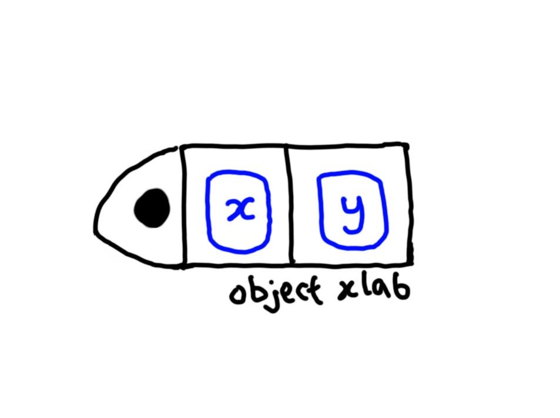
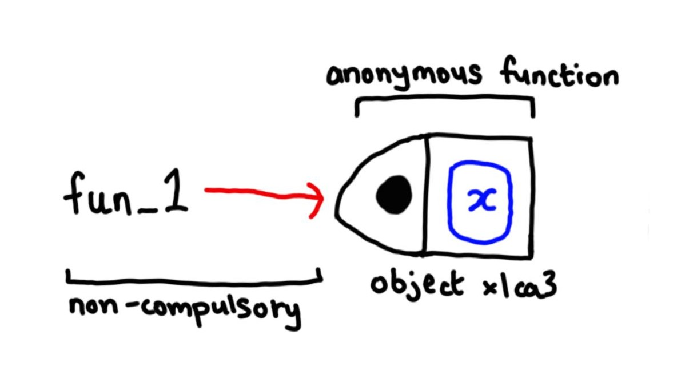

Chapter 6: Functions
================
Erika Duan
2021-01-07

  - [Chapter goals](#chapter-goals)
  - [Fundamental concepts of
    functions](#fundamental-concepts-of-functions)
      - [Function components](#function-components)
      - [Primitive functions](#primitive-functions)
      - [First-class functions](#first-class-functions)
      - [Invoking a function](#invoking-a-function)
  - [Function composition](#function-composition)
  - [Lexical scoping](#lexical-scoping)
      - [Name masking](#name-masking)
      - [Functions versus variables](#functions-versus-variables)
      - [A fresh start](#a-fresh-start)
      - [Dynamic lookup](#dynamic-lookup)
  - [Lazy evaluation](#lazy-evaluation)
      - [Promises](#promises)
      - [Default arguments](#default-arguments)
      - [Missing arguments](#missing-arguments)
  - [Using `...`](#using-...)
  - [Exiting a function](#exiting-a-function)
      - [Implicit versus explicit function
        returns](#implicit-versus-explicit-function-returns)
      - [Creating invisible returns](#creating-invisible-returns)
      - [Function errors](#function-errors)
      - [Exit handlers](#exit-handlers)
  - [Function forms](#function-forms)
      - [Prefix form](#prefix-form)
      - [Infix functions](#infix-functions)
      - [Replacement functions](#replacement-functions)
      - [Special forms](#special-forms)

``` r
#-----load R libraries-----   
if (!require(pacman)) install.packages("pacman")
p_load(tidyverse)  
```

# Chapter goals

Understanding how **functions** operate helps you to:

  - Understand the basic three components of a function.  
  - Understand the difference between a primitive and regular
    function.  
  - Discuss the strengths and weaknesses of different function
    composition approaches.  
  - Understand how R finds the value associated within a given name
    locally inside a function.  
  - Understand how arguments, including the special argument `...`,
    operate.  
  - Understand the two ways that a function can exit.  
  - Understand the ways in which R disguises ordinary function calls.

# Fundamental concepts of functions

## Function components

Functions are just objects which can be broken into three components:

  - Arguments or `formals()` - the list of arguments that control how
    you call the function.  
  - Body - the code inside the function.  
  - Environment - the data structure that determines how the function
    finds the values associated with the names.

The only exception is a small selection of `primitive` base functions,
which are implemented in C.

**Note:** The `formals()` and body are specified explicitly when you
create a function, but the environment is specified implicitly based on
where you defined the environment.

``` r
#-----examine function components-----
new_function <- function(x, y) {
  # function adds x and y together  
  x + y
}

formals(new_function)
#> $x
#> 
#> 
#> $y 

body(new_function)
#> {
#>     x + y
#> }  

environment(new_function)
#> <environment: R_GlobalEnv>  

typeof(new_function)
#> [1] "closure"  

# functions are also called closures
# this refers to the fact that R functions capture and enclose their environments    
```

The shape of this simple function is depicted below, with arguments
represented inside blocks and the environment represented by the black
dot on the left.



Since functions are objects, they can also possess attributes. One such
attribute is `srcref`, which points to the source code used to create
the function. Examining the attribute `srcref` is useful as it prints
function body comments and other formatting.

``` r
#-----examine attr(function, "srcref")-----  
attr(new_function, "srcref")

#> function(x, y) {
#>   # function adds x and y together  
#>   x + y
#> }      
```

## Primitive functions

The exception to the observation that a function has three components is
the primitive function.

Primitive base R functions like `sum()` and `[` call C code directly.
They have type `builtin` or `special` and can be identified using
`typeof()` or `is.primitive()`.

``` r
#-----identify primitive functions-----
get("sum")
#> function (..., na.rm = FALSE)  .Primitive("sum")

typeof(sum)
#> [1] "builtin"   

is.primitive(sum)
#> [1] TRUE  

get("[")   
#> .Primitive("[")    

typeof(`[`)   
#> [1] "special"    

is.primitive(`[`)
#> [1] TRUE  
```

Because these functions are implemented in C, calling `formals()`,
`body()` and `environment()` all return `NULL`.

``` r
#-----primitive functions have NULL formals, body and environment-----  
formals(sum)
#> NULL

body(sum)
#> NULL

environment(sum)
#> NULL  

attr(sum, "srcref")
#> NULL  
```

**Note:** Although primitive functions have significant performance
advantages, they are difficult to write and it is recommended to avoid
creating them unless you have no other option.

## First-class functions

As functions are objects in their own right, this means that you can
simply create a function object using `function()` and then assign a
name to it using `<-`. This is depicted below.



The name binding step is not compulsory and the creation of unnamed
anonymous functions is allowed. Anonymous functions are convenient in
scenarios when you do not want to think up a separate new function name.

``` r
#-----compare named versus anonymous functions-----  
fun_1 <- function(x){
  1/x
}  

fun_1(c(1, 2, 5)) # call a named function
#> [1] 1.0 0.5 0.2   

vapply(c(1, 2, 5), function(x) 1/x, 1) # call an anonymous function     
#> [1] 1.0 0.5 0.2   
```

You can also put functions in a list and call them as objects from a
list.

``` r
#-----store and call functions from a list-----  
division_funs <- list(
  by_half = function(x) x/2,
  by_quarter = function(x) x/4,
  by_tenth = function(x) x/10
)

v1 <- c(1:5)

division_funs$by_tenth(v1)
#> [1] 0.1 0.2 0.3 0.4 0.5  
```

## Invoking a function

You can call a function by inputting individual arguments inside the
function name i.e. `mean(1:10, na.rm = TRUE)`.  
You can also store function arguments in a list and apply the function
`do.call(function, argument_list)`.

``` r
#-----input individual function arguments-----  
set.seed(123)
rnorm(5, mean = 2, sd = 0.5)
#> [1] 1.719762 1.884911 2.779354 2.035254 2.064644

#-----store arguments in list and call do.call-----  
args <- list(n = 5,
             mean = 2,
             sd = 0.5)  

set.seed(123)
do.call(rnorm, args)
#> [1] 1.719762 1.884911 2.779354 2.035254 2.064644   
```

``` r
#-----exercise 6.2.5.1-----  
# names can be created and bound to functions  
# functions do not intrinsically need to be bound to names   
# a function is an R object can have no, one or many names       

#-----exercise 6.2.5.2-----  
(function(x) 3)
#> function(x) 3  

(function(x) 3)()
#> [1] 3

# both anonymous functions look strange but the latter function correctly prints 3      
#> the extra () separates the function call from the anonymous function’s body    

#-----exercise 6.2.5.3-----  
# use anonymous functions if functions are short and concise and their purpose is easy to intuit    
# it is best practice to give longer and more complex functions clear descriptive names  

#-----exercise 6.2.5.4-----  
# you can use attr(function, "srcref") to examine the argument, body and function formatting  
# a primitive function will output NULL for formals(), body() and environment()  

is.function(function(x) 1/x)
#> [1] TRUE 

is.primitive(sum)
#> [1] TRUE  

#-----exercise 6.2.5.5-----  
objs <- mget(ls("package:base", all = TRUE), inherits = TRUE)
funs <- Filter(is.function, objs) 

str(funs[[1]])
#> function (e1, e2) 

n_args <- funs %>%
  map(~ formals(.x)) %>%
  map_int(~ length(.x)) 

n_args <- sort(n_args, decreasing = T)

n_args[1] # function with the highest number of arguments  
#> scan 
#>   22

summary(n_args == 0)
#>    Mode   FALSE    TRUE 
#> logical    1057     249

n_args[n_args == 0][1:5]
#>   -   !  !=   $ $<- 
#>   0   0   0   0   0 

funs[["!="]]
#> function (e1, e2)  .Primitive("!=")  

# a primitive function which has n_args == 0 
# but are there non-primitive functions with n_args == 0?  

non_prim_n_args <- funs %>%
  discard(~ is.primitive(.x)) %>%
  map(~ formals(.x)) %>%
  map(~ length(.x)) 

non_prim_n_args[non_prim_n_args == 0][1:2]
#> $.First.sys
#> [1] 0
#> 
#> $.fixupGFortranStderr
#> [1] 0

# check how many functions are primitive functions  

prim_funs <- Filter(is.primitive, objs)
length(prim_funs) 
#> [1] 200  

#-----exercise 6.2.5.6-----  
# formals() - list of function arguments  
# body() 
# environment()  

#-----exercise 6.2.5.7-----   
# when a function is created in the global environment, its environment is not printed     
```

**Note:** The function `Filter()` can be used to extract the elements of
a vector for which a predicate (logical) function gives true.

# Function composition

To compose multiple function calls, you can:

  - Nest the function calls.
      - Nesting `f(g(x))` is concise and suitable for short code
        sequences.
      - However, longer code sequences have to be read from the inside
        out and right to left and arguments can spread code over very
        long distances.
  - Save the intermediate results as variables.
      - Naming intermediate objects can be useful when the intermediate
        objects are important and serve other uses.
      - However, naming intermediate objects is unnecessary if they are
        just intermediate objects.
  - Use the `magrittr` pipe `%>%` to pipe objects across functions.
      - Piping allows you to read code from a left-to-right direction
        and focus on the functions being performed.
      - The need to name intermediate objects is also removed.
      - However, piping only works on functions that permit a linear
        sequence of transformations to be performed on the same
        object.  
      - Functions that are `%>%` pipe friendly must contain `f(object)`
        or `f(data)` as its first argument.

**Note:** According to Hadley Wickham, piping is commonly used for data
analysis pipelines but infrequently used for R package development.

``` r
#-----nest multiple functions-----  
deviation <- function(x) x - mean(x) # compose anonymous functions   
square <- function(x) x^2

set.seed(123)
x <- runif(1000)

sqrt(mean(square(deviation(x))))
#> [1] 0.2873401  
```

``` r
#-----save intermediate results as variables-----  
out <- deviation(x)
out <- square(out) 
out <- mean(out)
out <- sqrt(out)  
out 
#> [1] 0.2873401
```

With `magrittr` pipes, writing `x %>% f()` is equivalent to writing
`f(x)` and `x %>% f(y)` is equivalent to `f(x, y)`.

``` r
#-----use magrittr pipes-----  
x %>%
  deviation() %>%
  square() %>%
  mean() %>%
  sqrt()  
#> [1] 0.2873401
```

# Lexical scoping

Scoping is the act of finding and retrieving the value associated with a
name. In contrast, assignment is the act of binding a name to a value.

``` r
#-----intuition behind scoping-----
x <- 10

new_funs <- function() {
  x <- 20
  x
}

new_funs()
#> [1] 20

# new_funs returns 20 even though x <- 10 is a globally assigned variable 
```

Lexical scoping looks up the values assigned to names based on how a
function is defined (i.e. where values are defined). In computer science
terms, the scoping rules use a parse-time rather than run-time
structure.

Lexical scoping in R follows four primary rules:

  - Name masking  
  - Functions versus variables  
  - A fresh start  
  - Dynamic lookup

## Name masking

There is a name masking hierarchy:

1.  Names defined inside a function automatically mask names defined
    outside a function.  
2.  If a name is not defined inside a function, R next looks one level
    up in the global environment. If the name does not exist there, R
    looks one level up in external packages.  
3.  The same rules also apply when a function is defined inside another
    function.

<!-- end list -->

``` r
#-----R first looks for the value associated with a name inside the function-----  
x <- 10
y <- 20 

new_funs <- function() {
  x <- 200
  y <- 400 
  c(x, y)
}

new_funs()
#> [1] 200 400 

#-----R next looks one level up for the value associated with a name-----  
new_funs2 <- function() {
  x <- 200 
  c(x, y)
}

new_funs2()
#> [1] 200  20

# the value of y is found outside of the function and in the global environment  

#-----R first looks inside the smaller then larger function, then global enviroment-----  
x <- 10
y <- 20  
z <- 30

new_funs3 <- function() {
  y <- 2
  i <- function() {
    z <- 3
    c(x, y, z)
  }
  i() # returns x outside both functions, y inside function new_funs3, z inside function i
}

new_funs3()
#> [1] 10  2  3  
```

## Functions versus variables

When functions share the same name, the same rules of name masking also
apply to function names. When functions and non-functions share the same
name, they reside in different environments.

When you call a function by a name, R ignores non-function objects when
looking for the R function bound to the name.

``` r
#-----when functions share the same name-----
funs_1 <- function(x) x + 1

funs_1(100)
#> [1] 101

funs_2 <- function() {
  funs_1 <- function(x) x + 100 # funs_1 function inside funs2 has a different operation
  funs_1(100)
}

funs_2()
#> [1] 200
```

``` r
#-----when a function and non-function share the same name-----  
# R ignores non-function objects when retrieving the function bound to a name
funs1 <- function(x) x + 100

funs2 <- function() {
  funs1 <- 10
  funs1(funs1) # non-function funs1 is assigned to 10 and funs1() is recognised as a function
}

funs2()
#> [1] 110
```

**Note:** Regardless of these rules, always avoid naming different
objects with the same name\!

## A fresh start

Every time a function is called, a separate new environment is created
to host its execution. This means that a function has no memory of what
happened the last time that it was evaluated.

``` r
#-----demonstrate that a separate new environment is always created-----
funs1 <- function() {
  if (!exists("a")) {
    a <- 1
  } else {
    a <- a + 1
  }
  a
}

# a is not stored in the global environment  

funs1()
#> [1] 1

funs1()
#> [1] 1  

# when funs1() was first called, object a was created in a separate environment      
# when funs1() is called call, object a does not exist in the separately new environment     
```

## Dynamic lookup

R only looks for values when the function is run and not when the
function is created. Lexical scoping determines where, but not when to
look for values assigned to a name. Together, this means that the output
of a function can differ depending on what objects already exist outside
the function’s environment.

You can use `codetools::findGlobals(new_funs)` to find all external
dependencies within a function and then manually change the function’s
environment to `emptyenv()` i.e. an environment which contains nothing.

``` r
#-----values are only retrieved when the function is run-----  
add_one <- function() to_add + 1 # to_add does not exist but an error message is not triggered  
to_add <- 15
add_one()
#> [1] 16

to_add <- 1 # to_add is now bound to a different value
add_one()
#> [1] 2  
```

``` r
#-----find a function's external dependencies-----  
codetools::findGlobals(add_one)
#> [1] "+"      "to_add"  

environment(add_one) <- emptyenv()
# add_one()
#> Error in to_add + 1 : could not find function "+"   

# the global environment still contains to_add <- 1    
```

``` r
#-----exercise 6.4.5.1-----  
c <- 10 
c(c = c) # name = value  
#>  c 
#> 10 

# R recognises c() is a function and that we are reassigning a named value inside a function
# R treats functions and non-function objects as separate objects  

#-----exercise 6.4.5.2-----  
# name masking hierarchy (inside function, outside function inside global environment, from external packages)  
# functions versus variables (functions are treated differently to non-functions)  
# each function is called in a separate new environment 
# values are only retrieved when the function is called    

#-----exercise 6.4.5.3-----  
f <- function(x) {
  f <- function(x) {
    f <- function() {
      x ^ 2
    }
    f() + 1 # function is to produce output (x^2 + 1)    
  }
  f(x) * 2 # function is to produce output (x^2 + 1) * 2 
}

f(10)
#> [1] 202  
```

# Lazy evaluation

In R, function arguments are lazily evaluated, meaning that individual
arguments are only evaluated if they are called and accessed. This
allows you to include computationally expensive function arguments that
are only evaluated if needed.

Lazy evaluation has three features:

  - Promises
  - Default arguments  
  - Missing arguments

<!-- end list -->

``` r
#-----example of lazy evaluation----- 
fun_error <- function(random_object) {
  10
}

fun_error()
#> [1] 10 

# the argument x is not evaluated as x is never called  
# an error message is not produced if the argument x = ... is missing 

fun_error(random_object = 5)
#> [1] 10  
```

## Promises

Lazy evaluation is powered by a data structure called a promise.

A promise has three components:

  - An expression, like `x + y`, which gives rise to delayed
    computation.  
  - An environment where the expression should be evaluated.
  - A value which is computed and cached (temporarily stored somewhere
    else) the first time a promise is accessed, when the expression is
    evaluated in the specified environment. This ensures that the
    promise is accessed at most once.

<!-- end list -->

``` r
#-----arguments are bound and retrieved outside of a function-----  
y <- 10 

new_funs <- function(x) {
  y <- 100
  x * 2
} 

new_funs(x = y) # inputs y <- 10 which exists outside of the function  
#> [1] 20   
```

``` r
#-----a promise is evaluated once and its outputs are cached-----  
double_num <- function(x) { 
  message("Calculating...")
  x * 2
}

output_num_twice <- function(x) {
  c(x, x)
}

output_num_twice(double_num(100))
```

    ## Calculating...

``` r
#> Calculating...
#> [1] 200 200  

# output_num_twice() can retrieve a cached output for x, which is only called once inside double_num()    
```

**Note:** Promises cannot be manipulated with R code and exist in a
quantum state where they cannot be directly observed (as the R code will
force an immediate evaluation). Instead, quosures are used to convert
promises into an R object for easy inspection of its expression and
environment.

## Default arguments

Due to lazy evaluation, default values for arguments can actually be
defined in terms of other arguments or variables defined later in the
function itself. However, this practice is not recommended as it makes
code harder to read and outputs more difficult to predict.

``` r
#-----default argument inputs are very flexible-----  
bad_funs <- function(x = 1, y = x * 2, z = a + b) {
  a <- 10
  b <- 100
  
  c(x, y, z)
}

bad_funs()
#> [1]   1   2 110

# the argument z is called last inside the function body  
# after the function has bound a and b to newly specified values in its environment   
```

Default and user-supplied arguments are evaluated slightly differently,
as default arguments are evaluated inside the function.

``` r
#-----beware default versus user-supplied argument evaluation differences-----  
rm(list = ls()) # empty global environment  

new_funs <- function(x = ls()) {
  a <- 1
  x
}

new_funs()
#> [1] "a" "x"

# ls() is evaluated inside new_funs() environment     

new_funs(x = ls())
#> [1] "new_funs"  

# ls() is evaluated in global environment if we manually supply the same argument    
```

## Missing arguments

You can use `missing()` inside a list to determine if an argument’s
value comes from the user or from a default argument.

``` r
#-----how to use missing() to detect argument value origin-----  
new_funs <- function(x = 10) {
  x + 1
}

#> missing(new_funs(x = 15)) is not a valid use of missing   

#-----use missing() to determine argument value origin-----
missing_funs <- function(x = 10) {    
  list(missing(x), x) # prints TRUE or FALSE as to whether x is missing and x     
}   

str(missing_funs()) # default argument output    
#> List of 2         
#>  $ : logi TRUE        
#>  $ : num 10      

str(missing_funs(x = 10)) # user supplied argument output  
#> List of 2  
#>  $ : logi FALSE    
#>  $ : num 10    
```

**Note:** When functions have multiple arguments and there are multiple
argument value configurations that are acceptable, testing using
`missing()` may lead to misleading outputs.

``` r
#-----handling functions with multiple arguments----- 
args(sample)
#> function (x, size, replace = FALSE, prob = NULL) 
#> NULL  

# although it looks like sample requires a value for both x and size
# sample() actually uses missing() to provide a default if size is not specified  

sample 
#> function (x, size, replace = FALSE, prob = NULL) 
#> {
#>     if (length(x) == 1L && is.numeric(x) && is.finite(x) && x >= 
#>         1) {
#>         if (missing(size)) 
#>             size <- x
#>         sample.int(x, size, replace, prob)
#>     }
#>     else {
#>         if (missing(size)) 
#>             size <- length(x)
#>         x[sample.int(length(x), size, replace, prob)]
#>     }
#> }
#> <bytecode: 0x000002d6cba6f718>
#> <environment: namespace:base>

#----rewrite sample() for improved clarity----- 
# create infix function  
`%||%` <- function(lhs, rhs) { 
  if (!is.null(lhs)) {
    lhs
  } else {
    rhs
  }
}

sample <- function(x, size = NULL, replace = FALSE, prob = NULL) {
  size <- size %||% length(x)
  x[sample.int(length(x), size, replace = replace, prob = prob)]
}  
```

``` r
#-----exercise 6.5.4.1-----  
x_ok <- function(x) {
  !is.null(x) && length(x) == 1 && x > 0
}

# && behaves as a logical AND but does not evaluate further if the LHS is FALSE

x_ok(NULL)
#> [1] FALSE
x_ok(1)
#> [1] TRUE
x_ok(1:3)
#> [1] FALSE

# the alternative below is undesirable as outputs are not of the same type    
# using & causes all conditions including vectorised conditions to be evaluated     

x_ok <- function(x) {
  !is.null(x) & length(x) == 1 & x > 0
}

x_ok(NULL)
#> logical(0)
x_ok(1)
#> [1] TRUE
x_ok(1:3)
#> [1] FALSE FALSE FALSE

#-----exercise 6.5.4.2-----  
f2 <- function(x = z) {
  z <- 100
  x
}

f2()
#> 100

# this function illustrates the principle of lazy evaluation of default arguments  
# z is only evaluated when it is called       
# default arguments are always evaluated inside the function  

#-----exercise 6.5.4.3-----  
y <- 10

f1 <- function(x = {y <- 1; 2}, y = 0) {
  c(x, y)
}

f1(1, 0)
#> [1] 1 0  

y
#> [1] 10

# this function illustrates the principle of contained environments and name masking 
# arguments are only evaluated in the order that they are called  
# name masking occurs so that y = 0 is the value that is retrieved 
# the assignment of y in the global environment is unchanged  

#-----exercise 6.5.4.4-----
# hist() ensures that 'breaks' evaluates to a numeric vector containing at least two unique elements 
# xlim() is then computed by appling range() on the value assigned to 'breaks'     

#-----exercise 6.5.4.5-----  
show_time <- function(x = stop("Error!")) {
  stop <- function(...) Sys.time() # prints Sys.time regardless    
  print(x)
}  

show_time()
#> [1] "2020-11-16 13:02:09 UTC"   

# x = output of the function stop("Error!") when print(x) is called     

#-----exercise 6.5.4.6-----   
args(library)

#> function (package, help, pos = 2, lib.loc = NULL, character.only = FALSE, 
#>     logical.return = FALSE, warn.conflicts, quietly = FALSE, 
#>     verbose = getOption("verbose"), mask.ok, exclude, include.only, 
#>     attach.required = missing(include.only)) 
#> NULL

# we know from experience that library() can work with only one user-specified argument input    
# library() also returns all packages in the library specified by lib.loc if no arguments are entered        
```

# Using `...`

In R, functions can take any number of additional arguments using the
special argument `...`. This type of argument is called a variable
argument.

``` r
#-----use ... to create variable arguments-----  
funs_1 <- function(y, z) {
  list(y = y, z = z)
} 

funs_2 <- function(x, ...) { # add ... as a new function argument
  funs_1(...) # reference where additional arguments should be inserted  
}

funs_1(y = 2, z = 3)
#> $y
#> [1] 2
#> 
#> $z
#> [1] 3  

funs_2(x = 1, y = 2, z = 3)
#> $y
#> [1] 2
#> 
#> $z
#> [1] 3  

# argument values that are not explicitly set in funs_2 can be evaluated   
```

Methods of handling `...` to manage variable arguments:

  - Use `..N` to refer to elements of `...` by position.  
  - Use `list(...)` to evaluate arguments and store them in a list.

<!-- end list -->

``` r
#-----use ..N to refer to elements of ...-----
funs_3 <- function(...) {
  list(first = ..1, third = ..3)
}

funs_3(a = "hello", b = "second value", c = "world")
#> $first
#> [1] "hello"
#> 
#> $third
#> [1] "world"

# only the first and third variable argument values are evaluated  
```

``` r
#----use list(...) to evaluate and store arguments-----  
funs_4 <- function(...) {
  list(...)
}

funs_4(a = "hello", b = "world")
#> $a
#> [1] "hello"
#> 
#> $b
#> [1] "world"
```

There are two primary uses of `...`:

  - When your function takes another function `v_funs()` as an argument
    and you want some way to pass additional arguments to `v_funs()`.  
  - When your function is an S3 generic and you need some way to allow
    methods to take arbitary extra arguments. For example, `print()` can
    take in some many different object types that it would be impossible
    to pre-specify ever possible argument.

<!-- end list -->

``` r
#-----when to use ... as an argument-----  
list_1 <- list(c(1, 3, NA),
               c(2, NA, 4))  

str(formals(lapply)) # lapply() contains ... as an argument      
#> Dotted pair list of 3
#>  $ X  : symbol 
#>  $ FUN: symbol 
#>  $ ...: symbol 

lapply(list_1, mean, na.rm = T)
#> [[1]]
#> [1] 2
#> 
#> [[2]]
#> [1] 3

str(formals(print)) # print() contains ... as an argument   
#> Dotted pair list of 2
#>  $ x  : symbol 
#>  $ ...: symbol   

print(factor(c("a", "b", "c", "d")))
#> [1] a b c d
#> Levels: a b c d     

print(factor(c("a", "b", "c", "d")), max.levels = 2)
#> [1] a b c d
#> 4 Levels: a ... d      
```

There are two downsides to using `...`:

  - When you use `...` to pass arguments to another function, you need
    to carefully explain to users where those arguments go.  
  - Using `...` means that a misspelt argument will not raise an error,
    which makes it easier for typos to go unnoticed.

<!-- end list -->

``` r
#-----using ... causes argument typos to go unnoticed-----   
sum(c(1, 3, NA)) 
#> [1] NA  

sum(c(1, 3, NA), na.rm = T) 
#> [1] 4  

sum(c(1, 3, NA), na_rm = T) # typo is silently passed 
#> [1] NA 
```

``` r
#-----exercise 6.6.1.1-----
str(formals(sum))
#> NULL  

# no extra arguments exist for sum
# it calculates the sum of all objects inside the function  

str(formals(mean))
#> Dotted pair list of 2
#>  $ x  : symbol 
#>  $ ...: symbol 

# mean contains the variable argument ... and the first object represents x  
# mean(1, 2, 3) interprets 2 and 3 as additional arguments that are silently run  

mean(c(1, 2, 3))
#> [1] 2 

mean(1, 2, 3)
#> [1] 1  

#-----excercise 6.6.1.2-----  
str(formals(plot))
#> Dotted pair list of 3
#>  $ x  : symbol 
#>  $ y  : symbol 
#>  $ ...: symbol    

# from the help file, we know that plot() accepts additional arguments like graphical parameters    
# we can use par() to set or query graphical parameters    

par("col")
#> [1] "black"   

#-----exercise 6.6.1.3-----   
#> localTitle(main = main, sub = sub, xlab = xlab, ylab = ylab, ...)
#> localTitle is used to pass the col parameter as part of the ... argument to title()  
```

# Exiting a function

Most function exit in one of two ways:

  - The function returns a value, indicating successful evaluation.
  - The function throws an error, indicating function failure.

## Implicit versus explicit function returns

A function can return a value:

  - Implicitly - the last evaluated expression is the return value.  
  - Explicitly - the function `return()` is called on a value.

<!-- end list -->

``` r
#-----implicitly return a function value-----  
funs_imp <- function(x) {
  if (x < 10) {
    0 # last evaluated expression if x < 10
  } else {
    10 # last evaluated expression if x >= 10  
  }
}

funs_imp(5)
#> [1] 0  

funs_imp(23)
#> [1] 10  

#-----explicitly return a function value-----  
funs_exp <- function(x) {
  if (x < 10) {
    return(0) 
  } else {
    return(10)  
  }
}
```

## Creating invisible returns

Most functions return values visibly in that calling the function will
print the result. Automatic printing can be prevented by applying
`invisible()` to the last value in the function.

``` r
#-----create invisible function return-----  
vis_funs <- function(x) 1

vis_funs()
#> [1] 1  

invis_funs <- function(x) invisible(1) 

invis_funs()
#> no output is printed  

#----verify value of invisible function exists----- 
# wrap invisible function inside print() or ()  

print(invis_funs())
#> [1] 1  

(invis_funs()) 
#> [1] 1   

# use withVisible() to return function value and visibility flag  

withVisible(vis_funs())
#> $value
#> [1] 1
#> 
#> $visible
#> [1] TRUE

withVisible(invis_funs())
#> $value
#> [1] 1
#> 
#> $visible
#> [1] FALSE   
```

**Note:** The most common function that returns invisibly is value
assignment using `<-`. This behaviour is what makes it possible to chain
assignments i.e. `a <- b <- c <- 2` and evaluate pipes.

## Function errors

If a function cannot complete its assigned task, it should throw an
error with `stop()`. This immediately terminates the execution of the
function. An error is used to indicate that something is wrong and
forces the user to deal with this problem.

``` r
#-----use stop() to exit function and print error message-----  
stop_funs <- function() {
  stop("Error: this function always exits")  
  return(10)
}

# stop_funs()
#> Error in stop_funs() : Error: this function always exits
```

## Exit handlers

Sometimes a function needs to make temporary changes to the global
state. Manually cleaning these temporary changes with code can be
painful. To counter this, you can use `on.exit()` to set up an exit
handler that ensures all temporary changes to the global state are
undone.

From R documentation on `on.exit()`:

> `on.exit` records the expression given as its argument as needing to
> be executed when the current function exits (either naturally or as
> the result of an error). This is useful for resetting graphical
> parameters or performing other cleanup actions.

The exit handler will run regardless of whether the function exits
normally or with an error. A good example of using `on.exit()` is when
you connect to a database and need to ensure that the connection is
always closed after the query has run.

``` r
#-----add exit handler to function-----
new_funs <- function(x) {
  cat("Hello\n")  
  on.exit(cat("Goodbye!\n"), add = T)  
  
  if (x) {
    return(10) 
  } else {
    stop("Error: x has not been specified")
  }
}

new_funs(x = 1)    
#> Hello
#> Goodbye!
#> [1] 10  

# new_funs()  
#> Hello
#> Error in new_funs() : argument "x" is missing, with no default
#> Goodbye!  

#-----on.exit() use case-----    
library(RSQLite)

sqlite_get_query <- function(db, sql)
{
  conn <- dbConnect(RSQLite::SQLite(), db) # connect to database
  on.exit(dbDisconnect(conn), add = TRUE) # exit connection when you exit the function 
  dbGetQuery(conn, sql) # retrieve and return sql query
}
```

**Note:** Always set `add = TRUE` when using `on.exit()`, otherwise each
separate call to on.exit() will overwrite the previous exit handler.

The function `on.exit()` is useful because it allows you to place
clean-up code next to code that would trigger risky behaviour if not
dealt with.

``` r
#-----use on.exit() to write clean-up code-----     
cleanup <- function(dir, code) {
  old_dir <- setwd(dir)  
  on.exit(setwd(old_dir), add = T) # code to run to clean and set up your environment    
  
  old_opt <- options(stringsAsFactors = F)
  on.exit(options(old_opt), add = T) # code to run to clean and set up your current environment
}

#-----use on.exit() with lazy evaluation-----     
with_dir <- function(dir, code) {
  old <- setwd(dir) 
  on.exit(setwd(old), add = T) 
  
  force(code) # clearly force the evaluation of a function argument  
}  

getwd()
#> [1] "C:/Users/user/Desktop/R-advanced-notes/02_exercises"    

with_dir("..", getwd())
#> [1] "C:/Users/user/Desktop/R-advanced-notes"  
```

In terms of order, you would want the most recently added `on.exit`
expression to be run first. This can be controlled by setting the
argument `on.exit(after = FALSE)`.

``` r
#-----force expression order of on.exit() calls-----  
exit_seq <- function() {
  on.exit(message("a"), add = T)
  on.exit(message("b"), add = T)
}

exit_seq()
```

    ## a

    ## b

``` r
#> a
#> b   

exit_seq <- function() {
  on.exit(message("a"), add = T, after = F)
  on.exit(message("b"), add = T, after = F)
}

exit_seq
#> b
#> a  
```

``` r
#-----exercise 6.7.5.1-----  
# load() loads objects saved to disk in .Rdata files by the function save()
# when successfully evaluated, load() invisibly returns a character vector containing the name of newly loaded objects    

#-----exercise 6.7.5.2-----  
# write.table() writes an object to disk and invisibly returns NULL
# it would be more useful if write.table() could invisibly return the input data instead

#-----exercise 6.7.5.3-----   
# with_dir() temporaily changes the working direction  
# it sets the new working directory when the function is exited  

# (source, chdir = T) changes the working directory temporarily to the directory containing the file
# the code is passed via the file argument   

#-----exercise 6.7.5.4-----   
plot_pdf <- function(code) {
  pdf("test.pdf") # function starts the graphical device driver 
  on.exit(dev.off(), add = T) # always ensures we switch off the graphical device upon exiting   
  code
}

#-----exercise 6.7.5.5-----   
capture.output2 <- function(code) {
  temp <- tempfile() # create temporary file
  on.exit(file.remove(temp), add = TRUE, after = TRUE) # on exit, secondly removes the temporary file   

  sink(temp)
  on.exit(sink(), add = TRUE, after = TRUE) # on exit, firstly shuts down connection (i.e. diverts to NULL)

  force(code) 
  readLines(temp)
}

# capture.output2(cat("a", "b", "c", sep = "\n"))
#> [1] "a" "b" "c"
#> cannot remove file 'C:\Users\user\AppData\Local\Temp\RtmpolTLGs\file4bc46abe28ff'    

capture.output
```

# Function forms

In R, everything that exists is an object and everything that happens is
the result of a function call.

There are four different types of function calls:

  - Prefix - the function name comes before its arguments
    i.e. `funs_1(arg_1, arg_2, ...)`. This constitutes the majority of
    function calls.  
  - Infix - the function name comes in between its arguments i.e. `x +
    y`. Infix function forms are used for many mathematical operators
    and for user-defined functions that begin and end with `%`.  
  - Replacement - a function that replaces values by assignment
    i.e. `names(df) <- c("a", "b", "c")`.  
  - Special - exceptions like \``[[`, `if` and `for` that do not have a
    consistent structure but still play important roles in R.

**Note:** Any function call can be re-written in prefix form. This
ability allows us to use functional programming tools to augment
pre-existing functions.

``` r
#-----rewrite function form into prefix form-----  
1 + 3 # from infix form to prefix form    
#> [1] 4

`+`(1, 3)
#> [1] 4  

v1 <- c(1:3)
names(v1) <- c("a", "b", "c") # primitive function  

v1 # from replacement form to prefix form     
#> a b c 
#> 1 2 3 

`names<-`(v1, c("d", "e", "f")) # named vector is visibly returned
#> d e f 
#> 1 2 3 

for (i in 1:3) print(i) # from special form to prefix form  
#> [1] 1
#> [1] 2
#> [1] 3  

`for`(i, 1:3, print(i))
#> [1] 1
#> [1] 2
#> [1] 3  
```

``` r
#-----modify pre-existing function via prefix form-----  
multiply_by <- function(x, y) x * y  

lapply(list(1:3, 4:6), multiply_by, 10) # re-write lapply on multiply_by as a single prefix form  
#> [[1]]
#> [1] 10 20 30
#> 
#> [[2]]
#> [1] 40 50 60

lapply(list(1:3, 4:6), `*`, 10) # alternative way which converts * from infix into prefix form  
#> [[1]]
#> [1] 10 20 30
#> 
#> [[2]]
#> [1] 40 50 60
```

## Prefix form

With prefix function calls, arguments can be specified in three
different ways:

  - By position, without other references to argument names
    i.e. `help(mean)`.  
  - By partial matching to argument names i.e. `help(top = mean)`.  
  - By argument name i.e. `help(topic = mean)`.

In terms of order, values are matched back to arguments first by exact
name, then by unique prefixes and finally by position.

``` r
#-----demonstrate prefix argument specification methods-----  
complex_funs <- function(vector_a, vector_b, df_c) {
  list(a = vector_a,
       b = vector_b,
       c = df_c)
}  

v1 = c(1:3) 
v2 = c(LETTERS[1:3])
df_c = data.frame(id = paste0("id", 1:3),
                  item = c("rock", "pebble", "stone"),
                  stringsAsFactors = F)

#-----specify argument by position-----  
str(complex_funs(v1, v2, df_c))
#> List of 3
#>  $ a: int [1:3] 1 2 3
#>  $ b: chr [1:3] "A" "B" "C"
#>  $ c:'data.frame':   3 obs. of  2 variables:
#>   ..$ id  : chr [1:3] "id1" "id2" "id3"
#>   ..$ item: chr [1:3] "rock" "pebble" "stone"

#-----specify argument by partial matching or by inputting argument name-----  
str(complex_funs(vector_a = v1, vector_b = v2, df = df_c))
#> List of 2
#>  $ a: int [1:3] 1 2 3
#>  $ b:'data.frame':   3 obs. of  2 variables:
#>   ..$ id  : chr [1:3] "id1" "id2" "id3"
#>   ..$ item: chr [1:3] "rock" "pebble" "stone"   

# partially matched argument abbreviations need to be unique   

# str(complex_funs(vector = v1, vector = v2, df = df_c))
#> Error in complex_funs(vector = v1, vector = v2, df = df_c) : 
#>   formal argument "vector_a" matched by multiple actual arguments  
```

**Notes:** It is recommended to only use positional matching for the
first one or two arguments (i.e. the most commonly used arguments).
Argument names should be inputted for less commonly used arguments and
partial matching should always be avoided.

## Infix functions

Most mathematical operations take the form of infix functions, where the
function name comes in between its arguments. Infix operators are
defined from left to right.

You can also create your own infix functions that start with and end
with the operator `%`. Base R also uses this pattern to define infix
functions like `%in%` and `%*%`.

To define your own infix function, create a two argument function and
bind it to a name that starts and ends with `%`.

``` r
#----create custom infix function-----  
`%c%` <- function(a, b) paste0(a, b) 

"a" %c% "nd"
#> [1] "and"  
```

**Note:** The operators `-` and `+` are the two infix functions that can
be calld with a single argument.

``` r
#-----special infix operations-----  
+10
#> [1] 10  

-1
#> [1] -1  
```

## Replacement functions

Replacement functions behave as if they modify their arguments in place.
Replacement functions are used by placing the function call on the left
side of the assignment `<-`.

They must have the special name `any_name<-`, the arguments `x` and
`value` and return a modified object.

``` r
#-----create replacement function that modifies the second element of a vector-----  
`second<-` <- function(x, value) {
  x[2] <- value
  x
}

v1 <- c(1:4)
second(v1) <- "two" # <- is called on the RHS of the replacement function  

v1
#> [1] "1"   "two" "3"   "4" 

#-----replacement functions create a modified object copy-----  
v1 <- c(1:4)

tracemem(v1)
#> [1] "<0000027BB1BB5F68>"

second(v1) <- "deux"
#> tracemem[0x0000027bb1bb5f68 -> 0x0000027ba8253bc0]: 
#> tracemem[0x0000027ba8253bc0 -> 0x0000027ba8243940]: second<-   

#-----add extra arguments in replacement function-----
`modify<-` <- function(x, position, value) { # insert argument in between x and value  
  x[position] <- value  
  x  
}

modify(v1, position = 1) <- "une" # specify arguments on the LHS of <-  

v1
#> [1] "une"  "deux" "3"    "4"     
```

**Note:** When you call the function `modify(v1, position = 1) <-
"une"`, R turns the code into `x <-`modify\<-`(x, position = 1, value =
"une")`.

## Special forms

There are a few R language features that are written in special ways
(but also have prefix forms).

These functions include:

  - `(` - parenthesis  
  - `{` - parenthesis  
  - `[` - subsetting operator  
  - `[[` - subsetting operator  
  - `if`, `else`, `for`, `while`, `repeat`, `break` - control flow
    tools  
  - `function(arg1, arg2) {body} ('function'(alist(arg1, arg2), body,
    env))` - function

All special forms are implemented as primitive functions in C.

**Note:** To obtain R documentation on functions with special forms, use
the `help('(')` syntax which encloses special forms inside back ticks.

``` r
#-----exercise 6.8.6.1-----    
1 + 2 + 3
#> [1] 6  

`+`(`+`(1, 2), 3) 
#> [1] 6  

1 + (2 + 3) 
#> [1] 6

`+`(1, `+`(2, 3))
#> [1] 6

x <- c(LETTERS[1:5])

if (length(x) <= 5) x[[5]] else x[[1]]  
#> [1] "E"   

`if`(length(x) <= 5, x[[5]], x[[1]]) # `if`(condition, if TRUE, if FALSE)  
#> [1] "E"    

`if`(`<=`(length(x), 5), `[[`(x, 5), `[[`(x, 1)) # final prefix form    
#> [1] "E"  

#-----exercise 6.8.6.2-----  
x <- sample(replace = TRUE, 20, x = c(1:10, NA))
#> x <- sample(c(1:10, NA), 20, replace = TRUE)
 
y <- runif(min = 0, max = 1, 20)
#> y <- runif(20, min = 0, max = 1)  

cor(m = "k", y = y, u = "p", x = x)
#> cor(x, y, use = "pairwise.complete.obs", method = "kendall")  

#-----exercise 6.8.6.3-----  
# modify(get("x"), 1) <- 10
#> Error: target of assignment expands to non-language object

# this code can be rewritten as get("x") <- `modify<-`(get("x"), 1, 10)
# get("x) <- 2 is what produces the error message  

#-----exercise 6.8.6.4-----    
`random_change<-` <- function(x, value) {
  x[sample(length(x), 1)] <- value
  x
}

v1 <- c(1:5)

set.seed(123)
random_change(v1) <- "rand"

v1
#> [1] "1"    "2"    "rand" "4"    "5"   

#-----exercise 6.8.6.5-----   
`%c%` <- function(a, b) {
  if (is.numeric(c(a, b))) {
    sum(a,b)
  } else if (is.character(c(a, b))) {
    paste0(a, b)
  } else {
    stop("Error: input is not of numeric or character type")
  }
} 

1 %c% 2
#> [1] 3  

"hello" %c% "world"
#> [1] "helloworld"  

#-----exercise 6.8.6.6-----   
rep_funs <- apropos("<-", where = TRUE, mode = "function") # find all replacement functions in R  

rep_base <- rep_funs[names(rep_funs) == length(search())]

prim_rep_base <- mget(rep_base, envir = baseenv()) %>%
  Filter(is.primitive, .) %>%
  names()

length(prim_rep_base)
#> [1] 17  

#-----exercise 6.8.6.7-----  
# valid infix names include and sequence of characters inside `%x%` except another %.  
# you need to escape special characters using \ when defining the function name 

`%/\\%` <- function(a, b) paste0(a, b) # \ is a special character that needs to be escaped  

"a" %/\% "b"
#> [1] "ab" 

#-----exercise 6.8.6.8-----  
`%xor%` <- function(a, b) {
  # xor() evaluates TRUE if one or the other condition, but not both, are satisfied  
  xor(a, b)
}

is.numeric(1) %xor% is.numeric(1) 
#> [1] FALSE  

is.numeric(1) %xor% is.numeric("1")
#> [1] TRUE  

#-----exercise 6.8.6.9-----    
`%u%` <- function(a, b) {
  union(a, b)
}

c(1, 3, 4) %u% c(1, 5)  
#> [1] 1 3 4 5

`%n%` <- function(a, b) {
  intersect(a, b)
}

c(1, 3, 4) %n% c(1, 5)  
#> [1] 1

`%/%` <- function(a, b) {
  setdiff(a, b)
}

c(1, 3, 4) %/% c(1, 5) 
#> [1] 3 4  
```
