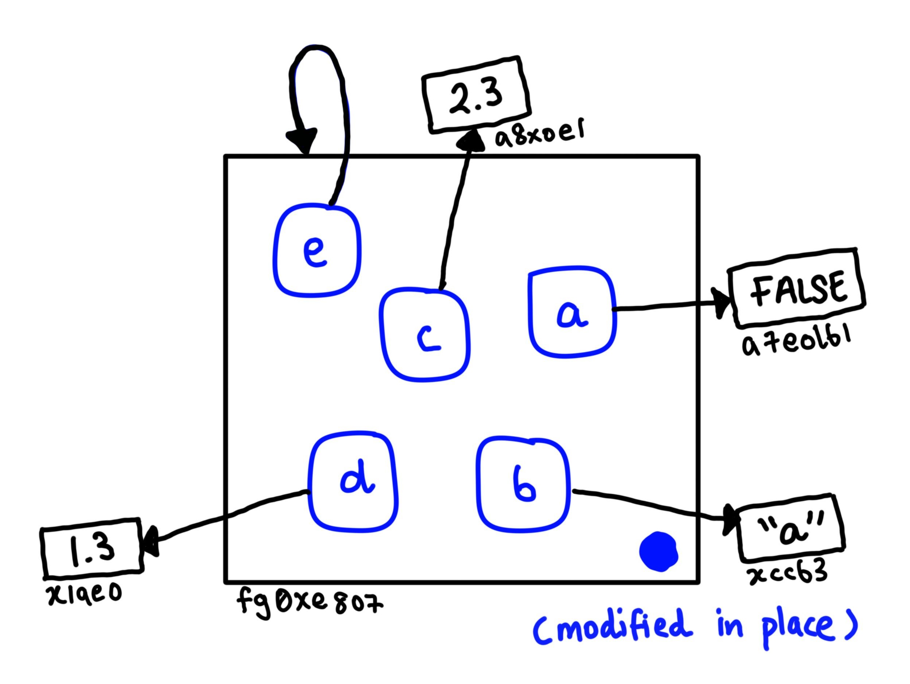
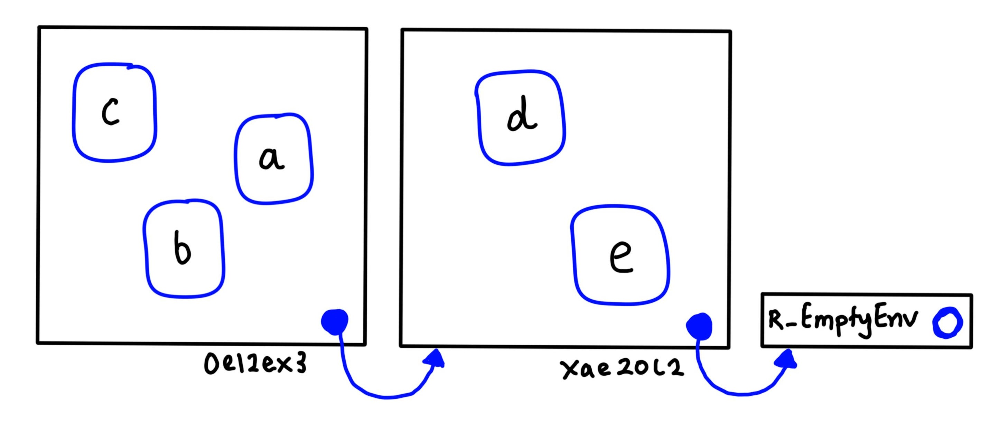

Chapter 7: Environments
================
Erika Duan
2021-01-08

  - [Chapter goals](#chapter-goals)
  - [Fundamental concepts of
    environments](#fundamental-concepts-of-environments)
      - [Creating a basic environment](#creating-a-basic-environment)
      - [Important R environments](#important-r-environments)
      - [Parent environments](#parent-environments)
      - [Super assignment using `<<-`](#super-assignment-using--)

``` r
#-----load R libraries-----   
if (!require(pacman)) install.packages("pacman")
p_load(rlang, # functions for working with environments  
       tidyverse)  

# rlang functions take an environment as the first argument and many also return an environment    
# rlang functions are also designed to be %>% friendly     
```

# Chapter goals

Understanding how **environments** behave in R helps you to:

  - Understand how to create your own environment in R.  
  - Use a function template to compute with environments.
  - Understand that different environments are used for special purposes
    i.e. for packages, inside functions, for namespaces or function
    execution.  
  - Understand how the caller environment behaves.  
  - Discuss where environments are useful data structures for solving
    other problems.

# Fundamental concepts of environments

## Creating a basic environment

An environment is similar to a named list with five exceptions:

  - Every object name inside an environment must be unique.  
  - The names in an environment are not ordered.  
  - An environment always has a parent.  
  - Environments are not copied when they are modified i.e. they are
    always modified in place.  
  - Environments can contain themselves.

To create an environment, we can use the function `rland::env()`, which
works similarly to `list()` by taking a set of name-value pairs. Values
must first be created separately and then added into an environment.

Use `new.env()` to create a new environment and ignore the `hash` and
`size` parameters.

``` r
#-----create new environment-----  
env_1 <- rlang::env(a = FALSE,
                    b = "a",
                    c = 2.3,
                    d = 1.3)   

# environments can contain themselves  

env_1$e <- env_1

#-----use env_print() to examine an environment-----  
rlang::env_print(env_1)
#> <environment: 00000297C0BB8EB0>
#> parent: <environment: global>
#> bindings:
#>  * a: <lgl>
#>  * b: <chr>
#>  * c: <dbl>
#>  * d: <dbl>
#>  * e: <env>  

#-----use env_names() to retrieve current bindings-----  
rlang::env_names(env_1)
#> [1] "a" "b" "c" "d" "e"     
```

An environment acts like a bag of names that has no implied order. Its
purpose is to bind a set of names to a set of values, as depicted below.



## Important R environments

There are two important environments in R:

  - The current environment `current_env()` - the environment in which
    the code is currently executing.  
  - The global environment `global_env()` - the environment outside of a
    function where all interactive computation takes place.

<!-- end list -->

``` r
#-----compare environments for equality-----  
identical(global_env(), current_env()) 
#> [1] TRUE  

#-----access global environment-----  
globalenv()
#> <environment: R_GlobalEnv>

#-----access current environment-----
environment()
#> <environment: R_GlobalEnv>

funs_1 <- function(){
  print(list(current_env = environment,
             is_identical = identical(global_env(), current_env())))
}

funs_1()
#> $current_env
#> function (fun = NULL) 
#> .Internal(environment(fun))
#> <bytecode: 0x00000297b2350a08>
#> <environment: namespace:base>
#> 
#> $is_identical
#> [1] FALSE
```

## Parent environments

Every environment has a parent environment. The parent environment is
what is used to implement lexical scoping - if a name is not found in
the current environment, R will then look in its parent environment and
so on.

You can set the parent environment by supplying an unnamed argument to
`env()`. Otherwise, R will default to the current environment.

``` r
#-----create two environments-----  
env_2_a <- rlang::env(d = 4,
                      e = 5) # create environment   

env_2_b <- rlang::env(env_2_a, # set env_2_a to parent environment  
                      a = 1,
                      b = 2,
                      c = 3)  

#-----specifically find environment parent-----
rlang::env_parent(env_2_b)
#> <environment: 0x00000297c28f47f8>  

rlang::env_parent(env_2_a)
#> <environment: R_GlobalEnv>   

#-----list all environment ancestors-----  
rlang::env_parents(env_2_b)
#> [[1]]   <env: 00000297C28F47F8>
#> [[2]] $ <env: global>  

rlang::env_parents(env_2_a) 
#> [[1]] $ <env: global>   
```



**Note:** By default, `env_parents()` stops when it gets to the global
environment because the ancestors of the global environment include
every attached external R package.

## Super assignment using `<<-`
