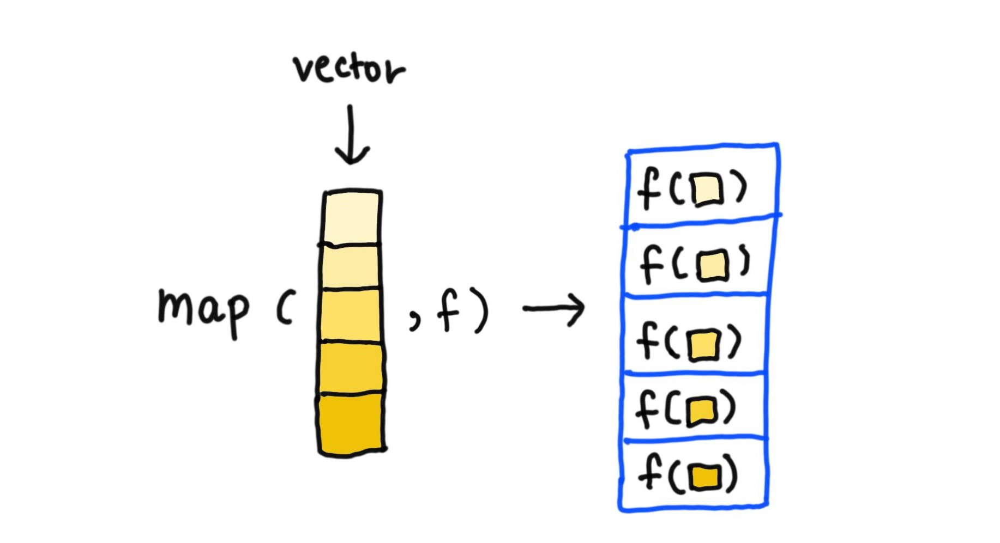
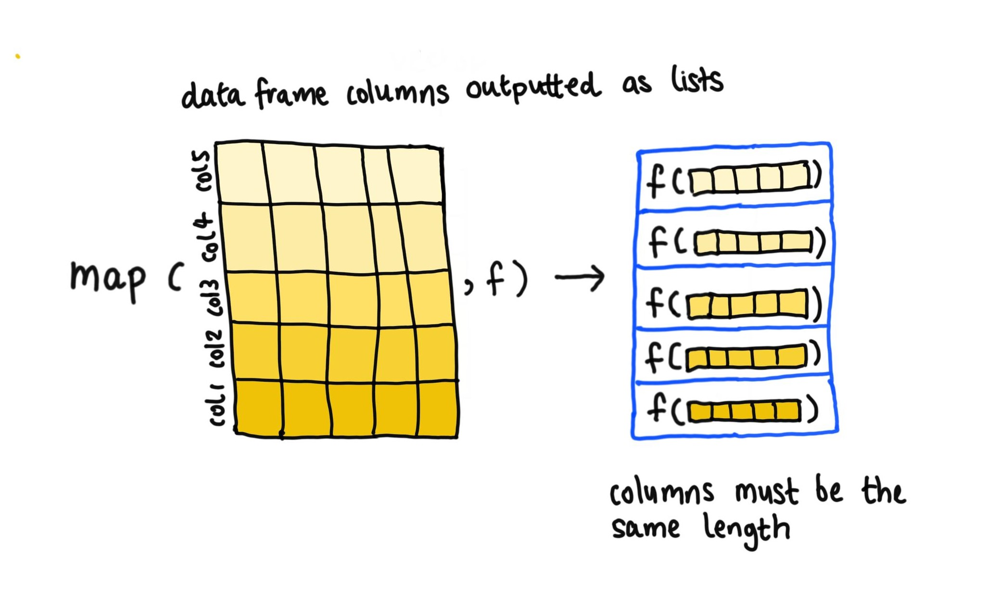

---
title: "Chapter 9: Functionals"  
author: "Erika Duan"
date: "`r Sys.Date()`"
output: 
  github_document:
    toc: true
---  

```{r setup, include = FALSE}
knitr::opts_chunk$set(echo = TRUE, results = 'hide')
```

```{r, message = FALSE, warning = FALSE}
# load R libraries -------------------------------------------------------------   
if (!require(pacman)) install.packages("pacman")
p_load(tidyverse)  
```


# Chapter goals   

Understand how to adopt best functional programming practices including:  

+ Understand the definition of a pure function.  
+ Learn how to decompose lengthy code into isolated and pure functions that operate independently.  
+ Replace for loops with generalised functions that take another function as an argument. 


# Fundamental concepts of functional programming       

Functional programming languages have:  

+ First-class functions - full versatility to handle functions as if they are just another data structure i.e. they can be assigned, stored in lists, passed as arguments to other functions or created inside other functions.     
+ Pure functions - reproducible and consistent outputs are generated from the same inputs, with no side-effects (i.e. global environment modifications) triggered.  

**Note:** Exceptions to pure functions include `runif()`, `sample()` and `Sys.time()` due to differing output generation, and `write.csv()` and `<-` due to global environment modification, although you can argue that the intention of these functions is always consistent.    


# Functional composition  

A functional is a function that:  
+ Takes a function as an input.    
+ Returns a vector as an output.  

```{r, fig.show = 'asis'}
# examples of simple functionals -----------------------------------------------
generate_random <- function(fx) fx(runif(n = 100, min = 0, max = 10))

# The syntax for anonymous functions is function(x) x + 2
# We use fx to denote that the argument fx represents a new function

generate_random(mean)
#> [1] 4.523039

generate_random(sd)
#> [1] 2.94176

generate_random(hist)
```

```{r}
# integration is a classical mathematical functional ---------------------------
fx_1 <- function(x) 2 * x
fx_2 <- function(x) sin(x)

integrate(fx_1, lower = 0, upper = 2)
#> 4 with absolute error < 4.4e-14

integrate(fx_2, lower = 0, upper = 2)
#> 1.416147 with absolute error < 1.6e-14
```

A common use of functionals is to act as a more readable, task-focused and output-focused alternative to for loops.  

```{r}
# For loop example -------------------------------------------------------------
iris <- datasets::iris[1:4]

output <- vector(mode = "integer", ncol(iris))
for (i in seq_along(iris)) {
  output[[i]] <- max(iris[[i]])
}

output
#> [1] 7.9 4.4 6.9 2.5

# Allocate sufficient space to output before you start the for loop
# Determine what sequence to loop over i.e. columns of df[[i]]
# Construct a body which contains the code to iterate over

# functional example using base R ----------------------------------------------
lapply(iris, max) %>%
  unlist()
#> Sepal.Length  Sepal.Width Petal.Length  Petal.Width
#>          7.9          4.4          6.9          2.5

# functional example using purrr -----------------------------------------------
map_dbl(iris, max)
#> Sepal.Length  Sepal.Width Petal.Length  Petal.Width
#>          7.9          4.4          6.9          2.5
```


# Introduction to `map()`  

The most fundamental functional in `tidyverse` is `purrr:map()`. It takes in a vector and function, calls the function once for each element of the vector and returns the results in a list i.e. `map(1:3, funs)` is equivalent to `list(funs(1), funs(2), funs(3)`. This means that the key characteristic of `map()` is that it returns a list which is the same length as the vector input. This implies that each call to the function must return a single value or object (i.e. a single list which contains multiple values).        

```{r}
# map() can return two outputs per function call -------------------------------
# Because each function call still outputs a single list (containing two values) 
return_pair <- function(x) c(x, x)  
map(1:3, return_pair)
#> [[1]]
#> [1] 1 1
#> 
#> [[2]]
#> [1] 2 2
#> 
#> [[3]]
#> [1] 3 3
```


```{r, echo = FALSE, results = 'markup', fig.align = 'center', out.width = '50%'}  

```

As data frames are just lists containing vectors (i.e. columns) of the same length, `map()` can also be applied across a data frame to return a list with length `ncol(df)`.    

```{r, echo = FALSE, results = 'markup', fig.align = 'center', out.width = '70%'}  

```

```{r}
# Code equivalent of map() -----------------------------------------------------
simple_map <- function(x, f, ...) {
  output <- vector(mode = "list", length(x)) # Returns list as final output
  for (i in seq_along(x)) {
    output[[i]] <- f(x[[i]], ...)
  }
  
  output   
  
}
```


## Generating atomic vectors as outputs  

As we mostly handle vectors or data frames in our analysis, it can be more convenient to convert the output of `lapply()` and `map()` from a list into an atomic vector or data frame object. 

```{r}
# Return numerical vector using map_dbl() or map_int() -------------------------
map_dbl(c(1:3), function(x) x ^ 2)
#> [1] 1 4 9 

# Return logical vector using map_dbl() ----------------------------------------
map_lgl(c(1:3), function(x) x > 2)
#> [1] FALSE FALSE  TRUE  

# Return character vector using map_chr() --------------------------------------
map_chr(letters[1:3], toupper)
#> [1] "A" "B" "C"  
```

This contains an extra requirement for each function to return one value as an output.     

```{r}
# map_() functions which return atomic vectors require single value outputs ----  
return_single <- function(x) x
map_dbl(1:3, return_single)
#> [1] 1 2 3  

return_pair <- function(x) c(x, x)
# map_dbl(1:3, return_pair)
#> Error: Result 1 must be a single double, not an integer vector of length 2 

# This error is avoided by using map() instead of map_dbl()  
map(1:3, return_pair)
#> [[1]]
#> [1] 1 1
#> 
#> [[2]]
#> [1] 2 2
#> 
#> [[3]]
#> [1] 3 3
```

**Note:** In base R, the equivalent of `map_()` is `vapply()`. The argument `FUN.VALUE` describes the output shape i.e. a character output of length 1 is written as `FUN.VALUE = character(1)`.       

```{r}
# vapply() outputs atomic vectors ----------------------------------------------  
map_chr(1:3, ~paste("id", .x))
#> [1] "id 1" "id 2" "id 3"

vapply(1:3, function(x) paste("id", x), FUN.VALUE = character(1))
#> [1] "id 1" "id 2" "id 3"
```


## Handling anonymous functions and shortcuts  

The function `map()` also requires the first argument of the input function to implicitly be the vector input i.e. `x`. For functions like `paste()` and `grep()` which do not support this structure, we can rewrite functions as inline anonymous functions or anonymous function shortcuts.     

```{r}
# Alternate ways to specify the input function ---------------------------------
map_chr(letters[1:3], toupper)
#> [1] "A" "B" "C"  

# map_chr(letters[1:3], paste0("ID", x))
# Error in paste0("ID", x) : object 'x' not found  

map_chr(letters[1:3], function(x) paste("Letter", x)) # Anonymous function
#> [1] "Letter a" "Letter b" "Letter c" 

map_chr(letters[1:3], ~paste("Letter", .x)) # Anonymous function shortcut  
#> [1] "Letter a" "Letter b" "Letter c"  

# map_lgl(letters[1:3], grepl("b", x))
# Error in grepl("b", x) : object 'x' not found  

map_lgl(letters[1:3], function(x) grepl("b", x))
#> [1] FALSE  TRUE FALSE

map_lgl(letters[1:3], ~grepl("b", .x))
#> [1] FALSE  TRUE FALSE
```

**Note:** The shortcut `~` translate formulas into functions and allows you to refer to `.x` for one argument functions, `.x` and `.y` for two argument functions and `..1`, `..2`, `..3` etc. for functions with an arbitrary number of arguments.  


## Passing arguments with `...`  
