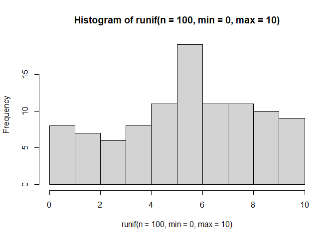

Chapter 9: Functionals
================
Erika Duan
2021-06-17

-   [Chapter goals](#chapter-goals)
-   [Fundamental concepts of functional
    programming](#fundamental-concepts-of-functional-programming)
-   [Functional composition](#functional-composition)

``` r
# load R libraries -------------------------------------------------------------   
if (!require(pacman)) install.packages("pacman")
p_load(tidyverse)  
```

# Chapter goals

Understand how to adopt best functional programming practices including:

-   Understand the definition of a pure function.  
-   Learn how to decompose lengthy code into isolated and pure functions
    that operate independently.  
-   Replace for loops with generalised functions that take another
    function as an argument.

# Fundamental concepts of functional programming

Functional programming languages have:

-   First-class functions - full versatility to handle functions as if
    they are just another data structure i.e. they can be assigned,
    stored in lists, passed as arguments to other functions or created
    inside other functions.  
-   Pure functions - reproducible and consistent outputs are generated
    from the same inputs, with no side-effects (i.e. global environment
    modifications) triggered.

**Note:** Exception to pure functions include `runif()`, `sample()` and
`Sys.time()` due to differing output generation, and `write.csv()` and
`<-` due to global environment modification, although you can argue that
the intention of these functions is always consistent.

# Functional composition

A functional is a function that:  
+ Takes a function as an input.  
+ Returns a vector as an output.

``` r
# examples of simple functionals -----------------------------------------------  
generate_random <- function(f) f(runif(n = 100, min = 0, max = 10)) 

generate_random(mean)
#> [1] 4.523039

generate_random(sd)
#> [1] 2.94176  

generate_random(hist)
```

<!-- -->

``` r
# integration is a mathematical functional --------------------------------------  
```
